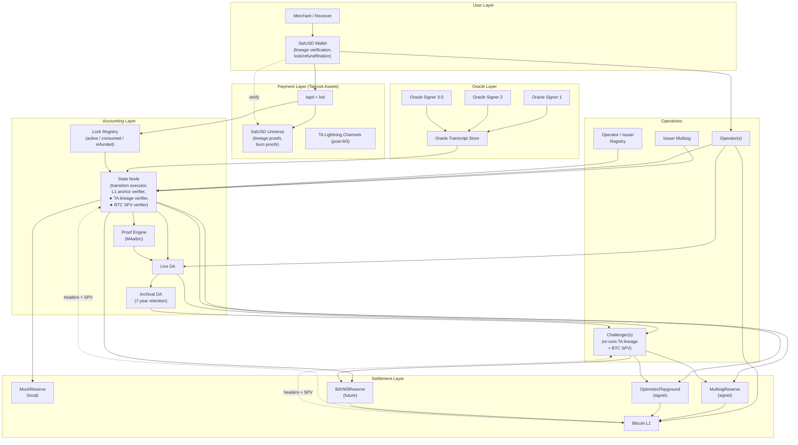
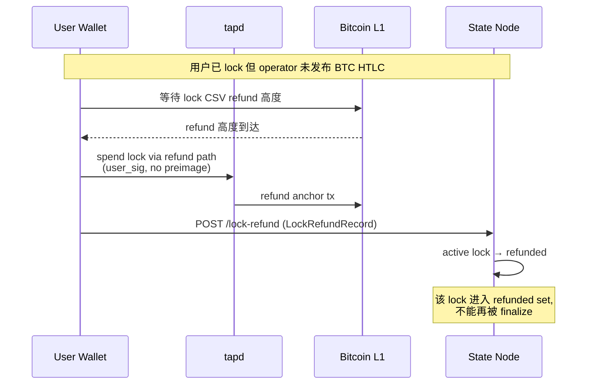

# SatUSD v5.1 — Product Requirements Document

**BitVM3-Backed BTC Reserve + Taproot Asset Payment Stablecoin**

| | |
|---|---|
| Status | **Solo / AI-assisted development draft — Conditional approval for M0/M1 only** |
| Version | v5.2 |
| Date | 2026-05-24 |
| Supersedes | v3 design draft、v4 implementation draft、v4.1 PRD draft、v5.0 PRD draft、**v5.1 PRD** |
| Maintainer | **Jeffery + AI coding/research agents** |
| Development mode | Solo + AI agent collaboration (see §16) |
| Review cadence | Per-milestone retro + per-discovery gate report (see §20) |

---

## 文档导读

本 PRD 面向 **solo 开发者 + AI coding/research agents** 协作。读者按需读取：

| 你是 | 必读 | 选读 |
|---|---|---|
| Jeffery (协议作者本人) | 全部 | — |
| AI coding agent (任务执行) | §0、§5、§6、§7、§8、§18、§19 + 任务描述 | §13 |
| AI research agent (discovery/调研) | §0、§5.D3、§9、§16、§17、相关 ADR | 全文 |
| Security review (外部审计 reviewer) | §0、§3、§5、§13、§17 | 全文 |

各章节末尾的 **"对接 contract"** 段落罗列了本章节产生的、其他章节依赖的具体输出物。这是为了让 PRD 可作为契约使用 —— solo 模式下，PRD 就是"团队记忆"，agent 之间通过 PRD + ADR 通信。

**v5.1 的新增结构性章节**：

- §5.D14（v5.1.X 新增）：**BTC Payment Confirmation Witness** —— 修复 v5.0 P0-#2 与 P0-#3。
- §5.D15（v5.1.X 新增）：**Lineage Verification Enforcement** —— 修复 v5.0 P0-#4。
- §5.D16（v5.1.X 新增）：**Protocol Sink as Verifiable Burn** —— 修复 v5.0 P0-#10（升级为 P0）。
- §5.D17（v5.1.X 新增）：**Lock State Machine (`active/consumed/refunded`)** —— 修复 v5.0 P1-#9。
- §5.D18（v5.1.X 新增）：**Circuit Commitment Boundary** —— 修复 v5.0 P0-#6（电路验证范围明确）。
- §16 改写：**Solo + AI Agent Development Mode**（任务格式、gate、ADR 规则）。
- §20 改写：**Solo session notes / milestone retros / ADR / discovery records**。

---

## 0. Decision Log (v3 → v4 → v4.1 → v5.0 → v5.1)

本节列出所有相对前序版本的**实质性**决策变更。开发与评审必须以此版为准。`v5.X` 标记 v5.0 的变更；`v5.1.X` 标记本版（v5.1）的变更——它们都直接对应到 v5.0 review feedback 的具体 P0/P1 项。

| ID | 决策 | 原因 / 关键依据 |
|---|---|---|
| DL-1 | MVP 采用 **Lock-first** 流程，不使用 `tapd.BurnAsset` 作为赎回入口 | `tapd.BurnAsset` 当前不提供可信赖的用户自定义 metadata 通道，旁路签名会破坏 nullifier 防双花 |
| DL-2 | `BurnRecord` 改名为 `LockRecord`；MVP 不通过 `BurnAsset` 走赎回 | Lock 输出在创建前可把 `redeem_intent_hash` 固化进 script key tweak |
| DL-3 | Operator fast redemption 采用 **HTLC 原子化**：SatUSD lock ⇄ BTC HTLC，共用 `payment_hash` | 杜绝 "用户先 burn 后 operator 不付" 的资金漏洞 |
| DL-4 | 引入 **L1 anchor commitment** 作为 BitVM3 light client 的过渡 | MVP 阶段没有链上 light client，需要绑定真实 Bitcoin 时间以防伪造 oracle freshness |
| DL-5 | Oracle 钉死 **EdDSA-BabyJub + Poseidon**、独立 signer quorum（MVP 3-of-5、Pilot 5-of-7） | 避免在 Groth16 内验证 secp256k1 BIP340；避免单 adapter key 退化为 1-of-1 信任根 |
| DL-6 | 取消独立 `T_ORACLE_UPDATE`，oracle 价格作为各 transition 的隐式公开输入；tier 每次 transition 重算 | 防 operator 选择性触发/不触发 oracle update |
| DL-7 | Reserve backend 抽象拆为 **ReserveBackend**（普通审批）和 **OptimisticEnforcementBackend**（assert/disprove/withdraw 三段式） | MultisigReserve 不应假装三段式，否则 challenger 代码在 BitVM3 阶段需重写 |
| DL-8 | 增加 §5.D11 **Issuer 生命周期** | 稳定币核心不可缺；MVP 明确 issuer 是项目方 multisig |
| DL-9 | `decimals = 2`，1 SatUSD = 100 atoms | 钱包/CLI 显示一致性；避免 `100000000` 的 UX 失败 |
| DL-10 | Tier 1（mint pause）纳入 MVP | 即使无完整清算机制，BTC 跌破阈值也必须自动停发 |
| DL-11 | DA 拆 **live DA**（≤ 挑战期）与 **archival DA**（≥ 7 年） | 两类需求的 SLA、保留期、付费方不同 |
| DL-12 | 增加 `RECLAIM_STALE_CLAIM`，BitVM3 graph 在 setup 时就必须预留 reclaim path | 防止 pending claim 永久占用 reserve |
| DL-13 | M4 拆 M4a/M4b/M4c | 原 8-12 周对 SMT + EdDSA-BabyJub + 配套 toolchain 严重低估 |
| DL-14 (v5.X) | `max_single_redemption_atoms = 1_000_000_000`（$10M）协议级硬上限 | 单笔金额超过 $184k 时 `amount * 10^14` 在 u64 即溢出，PRD 必须钉死上限与 widening 规则 |
| DL-15 (v5.X) | `lock_timeout_height` 与 `btc_htlc_timeout_height` 改为**相对锁定（CSV）**而非绝对锁定（CLTV） | 用户在 lock 创建时可能不知道 operator 的具体 BTC HTLC 高度；相对锁定让两侧时间窗可独立设置 |
| DL-16 (v5.X) | 同一 `RedeemIntent` 在状态机中**最多绑定一个 operator**；多 operator quote 必须使用不同 `redemption_id` | 解决多 operator 看到同一 lock 后的 race condition |
| DL-17 (v5.X) | `RedeemIntent.requested_oracle_epoch` 由 operator 在 quote 时决定，电路验证 freshness 窗口（**v5.1 修正**：基于 `chain_time` 而非 MTP，见 §5.D6） | 防止 operator 在 claim 时挑选对自己最有利的旧 epoch |
| DL-18 (v5.X) | Lock script 采用 **Taproot Assets vPSBT + Bitcoin Taproot script tree** 双层结构，详见 §5.D3 | tapd 的资产层"script lock"通过 anchor 交易的 Bitcoin taproot script tree 实现；PRD 需明确两层各自的脚本路径 |
| DL-19 (v5.X) | 增加 **claim 序列化与等幂性**要求：同一 `claim_id` 重复提交必须等幂 | Multisig 和 BitVM3 阶段的 mempool 替换、CPFP 可能导致状态机看到重复请求 |
| DL-20 (v5.X) | 增加 **Wallet 集成规范** §12 与 **运营 SLA** §15 | v4.1 缺产品维度，PRD 不能开工 |
| DL-21 (v5.X) | ~~增加资源估算与团队配置~~（v5.1 替换为 Solo + AI Agent 模式，见 §16） | solo 开发模式 |
| **DL-22 (v5.1.X)** | **Operator finalize 与 reserve claim 必须基于 confirmed BTC HTLC claim spend**：禁止仅凭 mempool preimage finalize；引入 `BTC_CLAIM_CONFIRMATION_DEPTH = 6` 与 SPV proof，详见 §5.D14 | 修复 v5.0 P0-#2 / P0-#3。Mempool preimage 可被 RBF / reorg / 踢出；不加确认深度会让 "operator 已支付用户" 退化为 witness 自述 |
| **DL-23 (v5.1.X)** | **Taproot Asset lineage 必须由 state node 强制独立验证**，`asset_proof_hash` 不再是信任锚点；challenger 必须可复算；BitVM3 阶段定义 fake-lineage dispute path，详见 §5.D15 | 修复 v5.0 P0-#4。`asset_proof_hash` 单独不能阻止恶意 operator 构造假 LockRecord |
| **DL-24 (v5.1.X)** | **CR/mint/tier 公式全部修正**：使用 `cr_ppm = reserve_sats * price_e8 * 10^6 / (supply_atoms * 10^14)`，原 v5.0 公式错了 10^12 倍，详见 §5.D8 | 修复 v5.0 P0-#5。SatUSD atoms 是 cents，price_e8 是 USD×10^8，reserve_sats 是 sats，必须有 10^14 量纲转换 |
| **DL-25 (v5.1.X)** | **电路验证范围明确分层**：MVP 电路只验证 Poseidon-friendly commitments；SHA256 / secp256k1 / TapTweak 由 software verifier + challenger off-circuit 强制；BitVM3 阶段引入 lineage / lock-binding dispute 子路径，详见 §5.D18 | 修复 v5.0 P0-#6。原 v5.0 把 SHA256 / TapTweak 验证放进 M4c Groth16，与 EdDSA-BabyJub/Poseidon 的 gate 预算冲突 |
| **DL-26 (v5.1.X)** | **ClaimClock freshness 基准从 MTP 改为 `chain_time = MTP + MTP_LAG_OFFSET`**；默认 `MTP_LAG_OFFSET = 3600s`；MVP `max_epoch_lag` 与 `oracle_future_tolerance` 重新定义，详见 §5.D6 | 修复 v5.0 P1-#7。MTP 滞后 chain time 约 1 小时，把 MTP 当 "现在" 会让真实新 oracle 价格 90s 内无法通过 |
| **DL-27 (v5.1.X)** | **Mint capacity 在 `MINT_FINALIZE` 时重新检查 CR；不再在 `MINT_COMMIT` 阶段锁定**；§13 I-04 测试预期同步修正为 reject | 修复 v5.0 P0-#8。如果 commit 锁定，BTC 在 commit 后大跌时 finalize 会绕过 tier 1。安全侧错应一律选 reject |
| **DL-28 (v5.1.X)** | **Lock 状态机显式化**：增加 `lock_consumed_root`，定义 `active → consumed`（finalize）和 `active → refunded`（refund）单向迁移，详见 §5.D17 | 修复 v5.0 P1-#9。原 verifier 只 insert nullifier/finalize，没 consume active lock，并发与重算困难 |
| **DL-29 (v5.1.X)** | **Protocol sink 定义为可验证 burn**：`protocol_sink_script_key = SHA256("SATUSD_BURN_SINK_V1" || asset_family_id)`（NUMS-derived），并强制要求 Universe burn proof，详见 §5.D16 | 修复 v5.0 P1-#10（升级为 P0）。否则 SatUSD 真实流通量与 supply 长期裂缝 |
| **DL-30 (v5.1.X)** | **BTC HTLC script template 进入 §18 spec**：完整 tapleaf script、tapleaf hash、sighash flag、sequence、refund script、dust/fee 规则，详见 §18.6 | 修复 v5.0 P1-#11 |
| **DL-31 (v5.1.X)** | **文档状态从 "Approved for development" 降级为 "Solo/AI development draft — Conditional approval for M0/M1 only"**；建立四个 Discovery Gates G1-G4，详见 §16.4 | 修复 v5.0 P2-#12 与评审建议的四个硬 gate |
| **DL-32 (v5.1.X)** | **解决 §2.3 KPI 与 §13 总数不一致**：§13 共 **44 个**对抗场景，KPI 引用全部 44 个 | 修复 v5.0 P2-#13 |
| **DL-33 (v5.2)** | **增加 BitVM2Reserve 作为 BitVM3 的 fallback**（§11.5）：若 M7 末 BitVM3 上游成熟度不足（由新增 advisory gate G6 评估），降级到 BitVM2；二者实现同一 `OptimisticEnforcementBackend`，用户无感 | BitVM3 是 2026 新论文，工程化风险高；Citrea/Clementine 已证明 BitVM2 主网可用，需要一条已验证的退路 |
| **DL-34 (v5.2)** | **增加两个 advisory（非阻塞）gates**：G5 Covenant Landscape Review（每 6 个月）、G6 BitVM upstream readiness（M6），详见 §16.4；并在 §17 增加 R-coordination-1 | covenant 软分叉激活路径不确定会影响 BitVM 成本/可行性；需要周期性 review，且不把任何单一 BIP 当架构前提 |

**Note on `tapd.BurnAsset` 实测**：本 PRD 假定 MVP 阶段 `tapd.BurnAsset` 不可承载用户 metadata。M1 仍执行 BurnAsset discovery 任务（§9.2），但发现可用后属于增量优化，不进入 MVP 关键路径。

---

## 1. Executive Summary

### 1.1 协议定位

SatUSD 是一个 **Bitcoin 原生、BTC 超额抵押的美元计价稳定资产**。

它由三层组成：

1. **Payment Layer**：SatUSD 作为 Taproot Asset 在用户钱包之间发行、持有、转账，未来通过 Taproot Asset-aware Lightning channels 路由。
2. **Accounting Layer**：协议维护一个 `StateRoot` 状态机，记录总供给、reserve 余额、issuer position、operator claim、oracle 价格、lock/nullifier、DA commitment 与 tier 状态。
3. **Settlement Layer**：BTC 抵押先由 Mock/Multisig backend 支持开发与试点，长期迁移到 **BitVM3 reserve**，通过 optimistic verification 约束提款。

### 1.2 核心赎回流程（v5.1 修正版）

MVP 阶段的赎回路径是一个 **HTLC 原子化 Lock-Swap**，关键安全性变更（DL-22）已写入：

```
1. 用户生成 secret s, 计算 payment_hash = SHA256(s)
2. 用户构造 RedeemIntent (含 payment_hash), 计算 redeem_intent_hash
3. 用户把 SatUSD 锁入 Taproot Asset lock output:
     - lock_script_key = TapTweak(user_key, H(intent_hash || payment_hash))
     - script tree: { Finalize: preimage + operator_sig + CSV_short,
                      Refund:   user_sig + CSV_long }
4. Operator 看到 lock, 创建 BTC HTLC:
     - user 可用 s claim BTC
     - operator 可在 CSV 后 refund BTC
5. 用户用 s claim BTC HTLC
6. ★ User's claim spend 在 Bitcoin 上确认 ≥ BTC_CLAIM_CONFIRMATION_DEPTH (6 blocks)
7. ★ Operator 提取 preimage from confirmed claim spend (NOT from mempool)
8. Operator 用 s finalize SatUSD lock → 销毁到 protocol burn sink (NUMS-derived)
9. Operator 批量提交 REDEEM_FAST_FINALIZE claim, 附带:
     - BTC claim spend SPV proof (depth ≥ 6)
     - Universe burn proof for the SatUSD finalize
     - Full TA lineage proof for the original lock
10. Reserve backend 经审批/挑战后向 operator 报销 BTC
```

任何一方在任何环节停止，都通过相对锁定（CSV）超时退款回到初始状态。

### 1.3 MVP 成功定义

> 在 regtest 环境中，用户能完成 mint/receive/send/lock-redeem 全流程；operator 通过 BTC HTLC 支付用户；状态机正确更新 supply/reserve/nullifier；并通过 §13 全部 **44 项** adversarial 测试（按 milestone 分配验收 —— M3 必须通过 R-01..R-15 共 15 项）。

### 1.4 不在 MVP 范围内

- 主网真实资金。
- BitVM3 reserve（M8 长期目标）。
- 完整 liquidation auction (Tier 2)、Tier 3 settlement、multi-shard rotation。
- Lightning channel 内 SatUSD 流通（M3 后并行做）。
- 直接用户 reserve 提款（slow direct redemption 数据结构兼容但不实现 payout）。
- BurnAsset metadata-based redemption（待上游支持）。

### 1.5 关键利益相关方与责任划分

| 角色 | MVP 阶段身份 | 长期身份 | 关键责任 |
|---|---|---|---|
| **Issuer** | 项目方 2-of-3 multisig | Federation 或 permissionless vault | 锁 BTC 进 reserve、申请 mint、维护 CR |
| **Operator** | 1-3 个白名单 operator | 任何注册并 post bond 的实体 | 提供报价、垫付 BTC、批量 claim |
| **Oracle Signer** | 5 个独立 signer (3-of-5) | 7 signer (5-of-7) | 签 EdDSA-BabyJub 价格 attestation |
| **Challenger** | ≥ 1 个项目方 funded challenger | 任何运行 detection/enforcement 的实体 | 拉取 DA、复算 transition、产生 dispute |
| **Reserve Committee** | 3-of-5 multisig，与 Issuer 不重合 | BitVM3 接管后退役 | Multisig backend 阶段的审批者 |
| **State Node Operator** | Jeffery 自跑 + ≥ 1 第三方（Pilot 起） | 任何节点 | 跑 transition、维护 L1 anchor、暴露 RPC |
| **Wallet** | Reference wallet（solo 开发） | 任意第三方 | 验证 lineage、构造 lock、监听 refund |

**Solo 开发说明**：MVP 早期（M0-M3 regtest）所有角色由 Jeffery 自己 + AI agents 模拟运行；Multisig committee、第三方 state node、第三方 challenger 在 M5/M6 进入 signet pilot 阶段才需要真实独立方。

**对接 contract**：所有 §5 起涉及 "who can sign/initiate X" 的描述，必须能 trace 回上表的某一角色。

---

## 2. Product Goals, Non-Goals, KPIs

### 2.1 Product Goals

- **G1: Bitcoin-native reserve.** 抵押 BTC 锁在 Bitcoin L1。
- **G2: Payment UX.** 用户能像普通 Taproot Asset 一样转账 SatUSD，不感知 reserve。
- **G3: Safe redemption.** 任何阶段中断都不导致用户资金永久丢失；refund 路径对用户可见可操作。
- **G4: Verifiable accounting.** 任何人能从 `StateRoot` + DA 包独立复算并验证所有 mint/redeem。
- **G5: Progressive decentralization.** 从 Mock → Multisig → Optimistic Playground → BitVM3，信任假设逐阶段降低，且每阶段都有清晰的退出条件。
- **G6: Audit-ready.** 任何已 finalize 的 claim 在未来 7 年内可被独立检索、复算、报告。
- **G7 (v5.1 新增): No "trust the operator's witness".** Reserve reimbursement 不可基于 operator 的 self-report —— 任何 reimbursement 都必须有 confirmed Bitcoin SPV evidence + Universe burn proof + lineage proof 三件套作为可独立复算的证据。

### 2.2 Non-Goals

参见 §1.4。补充：

- 协议不承诺 SatUSD 在二级市场的价格稳定（这是经济与做市问题，不是协议问题）。
- 协议不规避监管合规义务（issuer/operator 自行处理）。
- 协议不解决 BTC 极端崩盘下的资不抵债（结构性问题；MVP 通过 Tier 1 暂停 + 单 issuer + cap 控制风险）。

### 2.3 Acceptance KPIs（按里程碑）

**M0-M3 (Regtest 阶段)：**

| KPI | 目标 |
|---|---|
| `StateRoot` 复算可重复性 | 100%（Rust ↔ TypeScript 字节级匹配 ≥ 1000 个测试向量） |
| Adversarial test 覆盖率 (M3) | §13 中 M3-tagged 全部场景 = 15 项 (R-01..R-15) |
| Lock refund 成功率 (regtest) | ≥ 99%（剩余 1% 容许工具问题） |
| Lock-to-BTC-HTLC 端到端时间 (regtest) | < 30 秒 |
| Operator finalize 到 claim 提交时间 | < 60 秒 (假设 6 块确认已完成) |
| BTC claim confirmation 等待时间 (regtest, 1 block/sec) | ≈ 6 秒 |

**M4-M6 (Circuit + Signet 阶段)：**

| KPI | 目标 |
|---|---|
| Groth16 proving time (batch=32) | < 5 分钟 (per gate-count report) |
| Circuit verification time | < 50ms |
| End-to-end signet redemption | < 4 小时（含 6-block 确认 + multisig 审批） |
| Multisig committee approval latency p95 | < 4 小时 |
| Challenger DA fetch p95 | < 1 分钟 |
| Stale claim reclaim correctness | 100% |
| Adversarial test 累计覆盖 (M6) | §13 中 M2/M3/M5/M6-tagged 全部 |

**M7-M8 (Optimistic / BitVM3 阶段)：**

| KPI | 目标 |
|---|---|
| Disprove tx 构造成功率 (优化播放场) | ≥ 99% |
| BitVM3 Assert 单 batch 成本 | ≤ $10 USD-equivalent |
| BitVM3 Disprove 单次成本 | ≤ $0.30 USD-equivalent |
| 端到端 redeem (BitVM3, 6h 挑战期) | ≤ 8 小时 |
| Adversarial test 覆盖 (M8) | §13 全部 44 项 |

### 2.4 Production Launch Gate（非 MVP，但必须在 PRD 中钉死）

进入主网试点（Phase 9）必须满足：

- ≥ 2 份独立安全审计完成且 issues 全部 close。
- ≥ 1 份经济风险审计完成。
- ≥ 5 个 operator 与 ≥ 5 个 challenger 已注册并通过试运行。
- Tier 2 (auction) 与 Tier 3 (settlement) 已实现且测试覆盖。
- Bug bounty 已运行 ≥ 90 天且无 critical findings 未解。
- 公开 reserve dashboard 已上线 ≥ 30 天。

**对接 contract**：§14 各 milestone 必须对应到这里的 KPI 目标。

---

## 3. Trust Model

### 3.1 MVP 阶段信任假设

MVP 是**开发与验证**阶段，不是最终安全模型。用户必须信任：

- **项目方 issuer multisig** 不恶意增发或滥铸。
- **Reserve Committee multisig** 按规则审批 reserve 释放。
- **Oracle quorum**（3-of-5）未被攻破。
- **State node 软件**正确执行 —— 但 v5.1 强制要求 state node 独立验证 TA lineage 和 BTC SPV proof（DL-23、DL-22），把信任面减小到"软件实现正确"而非"信任 operator 上报"。
- **Wallet 软件**正确验证 lineage 与 lock/refund 路径。
- **本地 bitcoind**（用户/操作员自跑）正确反映 Bitcoin 共识。

用户**不需要**信任：

- 任意单个 operator —— 因为 HTLC + timeout refund + confirmed-payment evidence。
- 任意单个 challenger —— MVP 阶段 challenger 仅做 detection/alert。
- DA 中任一镜像 —— 多镜像 + content-addressed。
- Operator 提交的 `asset_proof_hash` —— state node 自己复算 lineage（DL-23）。

### 3.2 长期信任假设（BitVM3 阶段）

用户信任：

- Bitcoin 共识。
- BitVM3 soundness（含 setup ceremony 存在性诚实假设：≥ 1 setup committee 成员诚实删除其 ephemeral key）。
- ≥ 1 honest challenger 在线、能拉到 live DA、能广播 Disprove。
- Oracle quorum（5-of-7）未被攻破。
- 实现层正确。

不再信任：

- 任意单个 issuer、operator、reserve committee 成员、DA mirror、state node。

### 3.3 信任假设清单（用于审计）

| 假设 | MVP | Pilot | Mainnet |
|---|---|---|---|
| Bitcoin 共识 | ✓ | ✓ | ✓ |
| Oracle quorum honest | 3-of-5 | 5-of-7 | 5-of-7 |
| Issuer multisig | 必须 | 必须 | 弱化为 federation |
| Reserve committee multisig | 必须 | 必须 | 由 BitVM3 替代 |
| Setup committee one-honest | n/a | n/a | 必须 |
| ≥ 1 honest challenger online | 建议 | 必须 | 必须 |
| Live DA available during dispute | 建议 | 必须 | 必须 |
| Archival DA available 7 years | 建议 | 必须 | 必须 |
| Wallet software correct | 必须 | 必须 | 必须 |
| State node independently re-verifies TA lineage (DL-23) | 必须 | 必须 | 由 BitVM3 dispute 兜底 |
| State node verifies BTC SPV (DL-22) | 必须 | 必须 | 必须（电路或 BitVM3） |

**对接 contract**：§13 adversarial test 必须覆盖该表中标"必须"的每一项。

---

## 4. System Architecture

### 4.1 组件视图



### 4.2 时序视图：Fast Redemption Happy Path（v5.1 修正版，含 confirmed BTC payout）

```mermaid
sequenceDiagram
  participant U as User Wallet
  participant TA as tapd
  participant O as Operator
  participant SN as State Node
  participant BTC as Bitcoin L1
  participant R as Reserve Backend

  U->>U: 生成 s, payment_hash = H(s)
  U->>O: GET /quote (amount, claim_pubkey)
  O->>SN: GET /state/latest, /l1-anchor/latest
  O-->>U: quote (price, fee, expires_at_height)
  U->>U: 构造 RedeemIntent, 派生 lock_script_key
  U->>O: POST /redeem-intent
  U->>TA: AnchorVirtualPsbts: lock SatUSD
  TA->>BTC: Anchor tx (lock output)
  U->>SN: POST /lock-record (with TA lineage proof)
  Note over SN: ★ SN 独立验证 TA lineage<br/>(DL-23)
  SN-->>O: lock confirmed in lock_record_root
  O->>BTC: 创建 BTC HTLC payout tx
  BTC-->>U: HTLC visible
  U->>BTC: claim HTLC with s
  Note over BTC: ★ wait for ≥ 6 confirmations<br/>(DL-22)
  BTC-->>O: confirmed claim spend; extract s
  O->>TA: spend lock with s + op_sig → burn sink
  TA->>BTC: finalize anchor tx (sends to NUMS-derived burn key)
  O->>Universe: publish burn proof
  O->>SN: POST /transition (REDEEM_FAST_FINALIZE)<br/>+ BTC claim SPV proof<br/>+ burn proof<br/>+ TA lineage
  Note over SN: ★ SN 验证 SPV, burn proof,<br/>lineage 全部 OK 才接受
  SN->>R: submit_claim
  R-->>O: reimbursement BTC
  Note over SN: StateRoot 更新: supply↓, reserve↓,<br/>active lock → consumed
```

### 4.3 时序视图：Refund Path（operator 不付款）



### 4.4 部署拓扑（MVP solo 模式）

```
       ┌────────────────────────────────────────────────────────┐
       │           Jeffery's dev machine + AI agents             │
       │                                                          │
       │  ┌──────────┐  ┌──────────┐  ┌──────────┐  ┌──────────┐ │
       │  │ State    │  │ Operator │  │Challenger│  │  Oracle  │ │
       │  │ Node     │  │  API     │  │ (detect) │  │ Signers  │ │
       │  └────┬─────┘  └────┬─────┘  └────┬─────┘  └────┬─────┘ │
       │       │             │             │             │       │
       │       └─────────────┴─────────────┴─────────────┘       │
       │                          │                              │
       │                   ┌──────▼──────┐                       │
       │                   │  bitcoind   │                       │
       │                   │  regtest    │                       │
       │                   │  + lnd      │                       │
       │                   │  + tapd     │                       │
       │                   └─────────────┘                       │
       └────────────────────────────────────────────────────────┘
```

**Solo 阶段（M0-M3）**：所有组件在 Jeffery 单机跑 + AI agents 并行任务执行。

**Pilot 阶段（M6 起）**：第二个 state node 由独立第三方运行；Reserve Committee 5 人独立持密钥；challenger 至少 1 名外部运行。

**关键运营要求（M6 起）**：state node 必须至少有 2 个独立运行实例（项目方 + ≥ 1 第三方），且二者必须能就 `StateRoot` 达成字节级一致。

**对接 contract**：§7 API 中所有 endpoint 的认证、限流、SLA 必须按 §15 列出。

---
## 5. Core Product Decisions（实现契约）

本节是 PRD 的核心。每条决策包含：**决策**、**验收测试**、**对接 contract**。开发不可绕过任何一条；如有疑问，提 ADR + Change Request，不可在代码里偏移。

v5.1 新增 D14-D18 主要回应 v5.0 review feedback 的 P0/P1 项。

---

### D1. Asset Identity, Decimals, Arithmetic Bounds

**决策**：

SatUSD 使用 Taproot Assets **reissuable normal asset** with group key。

资产族标识：

```
satusd_asset_family_id = SHA256(
  "SATUSD_ASSET_FAMILY_V1" ||
  genesis_asset_id ||              // 32 bytes
  group_key ||                     // 33 bytes (compressed secp256k1)
  chain_id                         // 1 byte: 0x00 regtest, 0x01 signet, 0x02 mainnet
)
```

**Decimals = 2**。1 SatUSD = 100 atoms。所有协议字段中的 `amount_satusd_atoms` 均以 cent-atoms 为单位。

**数值范围与算术规则**：

| 字段 | 类型 | 范围 |
|---|---:|---|
| `amount_satusd_atoms` | `u64` | `[100, 1_000_000_000]` ($1 ~ $10M) |
| `sat_usd_supply_atoms` | `u64` | `[0, 10^14]` ($0 ~ $1T 软上限) |
| `reserve_btc_sats` | `u64` | `[0, 21_000_000 * 10^8]` |
| `price_e8` (BTC/USD) | `u64` | `[10^9, 10^14]` ($10 ~ $1M/BTC) |
| `collateral_ratio_ppm` | `u64` | `[0, 10^9]` (0~1000x，PPM 表示) |

**算术安全规则（必须）**：

- 所有乘法计算必须先 widen 到 `u128`。
- 最终结果回到 `u64` 时必须 `checked_into()`。
- 任何溢出 = panic（开发期）/ revert transition（运行期）。
- 除法采用 **floor** 语义，并显式记录 dust。

**核心 BTC payout 换算公式（必须照此实现）**：

```rust
// 输入: amount_atoms (u64), price_e8 (u64)
// 输出: gross_btc_sats (u64)
let num : u128 = (amount_atoms as u128) * (10u128.pow(14));
let den : u128 = price_e8 as u128;
let gross : u128 = num / den;
assert!(gross <= u64::MAX as u128, "gross BTC overflow");
let gross_btc_sats : u64 = gross as u64;
```

推导：

```
amount_usd     = amount_atoms / 100
price_usd_btc  = price_e8 / 10^8
gross_btc      = amount_usd / price_usd_btc 
               = amount_atoms / 100 * 10^8 / price_e8
               = amount_atoms * 10^6 / price_e8       (单位: BTC)
gross_btc_sats = gross_btc * 10^8
               = amount_atoms * 10^14 / price_e8       (单位: sats)
```

**单笔上限的依据**：上述公式中 `amount_atoms * 10^14` 在 `amount_atoms = 10^9` 时为 `10^23`，仍在 `u128` 内（`u128_max ≈ 3.4 × 10^38`）。`u64` 中间值会在 `amount_atoms ≈ 1.8 × 10^5`（约 $184）时即溢出，因此**禁止用 u64 直接乘**。

**对接 contract**：
- 所有 §6 中的字段必须显式标记类型 + 范围。
- §8 电路里必须使用 fixed-width gadget。
- §12 Wallet 显示 SatUSD 余额时必须显示 `display = atoms / 100` 形式 + cent。
- CR/mint/tier 公式见 D8（v5.1 修正版）。

---

### D2. Lock-First Redemption Flow

**决策**：

MVP 不使用 `tapd.BurnAsset` 作为赎回入口。赎回的物理入口是**用户构造的 Taproot Asset custom-script lock**，其 script key 在创建前就由 `RedeemIntent` 派生。

`RedeemIntent` 结构（**canonical encoding，所有字段顺序与字节序由 §18 spec 定义**）：

```rust
struct RedeemIntent {
  version:                 u16,        // 当前 = 1
  network:                 u8,         // 0=regtest, 1=signet, 2=mainnet
  redemption_id:           [u8; 32],   // 用户随机数 + 防重放
  satusd_asset_family_id:  [u8; 32],
  amount_satusd_atoms:     u64,        // ∈ [100, 1_000_000_000]
  user_btc_refund_pubkey:  [u8; 32],
  user_btc_claim_pubkey:   [u8; 32],
  user_asset_refund_key:   [u8; 32],
  operator_id:             Option<[u8; 32]>,
  mode:                    u8,         // 0=FAST_OPERATOR, 1=SLOW_DIRECT
  payment_hash:            [u8; 32],
  asset_lock_csv_delta:    u32,
  btc_htlc_csv_delta:      u32,
  max_operator_fee_bps:    u16,
  l1_anchor_height:        u32,
  l1_anchor_hash:          [u8; 32],
  expiry_height:           u32,
  nonce:                   [u8; 32]
}
```

约束（协议必须 enforce）：

```
asset_lock_csv_delta >= btc_htlc_csv_delta + refund_safety_delta
refund_safety_delta = max(24 blocks, BTC_CLAIM_CONFIRMATION_DEPTH + finalize_window)
mode == FAST_OPERATOR => operator_id is Some
mode == SLOW_DIRECT   => operator_id is None AND amount_satusd_atoms >= 2500
expiry_height >= l1_anchor_height + 144  (lock 至少 1 天有效)
```

> **v5.1 修正**：`refund_safety_delta` 必须能容纳 BTC claim 的 6 块确认窗口 + operator finalize 时间。
> 这是 DL-22 的间接影响：用户 claim 之后到 operator 能 finalize 之间至少要 6 块 + buffer。

`redeem_intent_hash` 派生：

```
redeem_intent_hash = SHA256(
  "SATUSD_REDEEM_INTENT_V1" ||
  canonical_encode(RedeemIntent)
)
```

**验收测试**：
- 同一 `RedeemIntent` 在 Rust 与 TypeScript 编码后字节相等。
- 修改任何字段后 hash 改变。
- `mode = FAST_OPERATOR && operator_id = None` 拒绝。
- `asset_lock_csv_delta < btc_htlc_csv_delta + refund_safety_delta` 拒绝。

**对接 contract**：§5.D3、§5.D4、§5.D14、§6.2、§8.3。

---

### D3. Lock Script Construction

**决策**：

SatUSD 的 lock 是**两层结构**：

1. **Taproot Asset 层**：`tapd` 通过 `FundVirtualPsbt` + `AnchorVirtualPsbts` 把 SatUSD 移动到一个新的 Taproot Asset output，其 `script_key` 由 `RedeemIntent` 派生。
2. **Bitcoin Taproot 层**：anchor 交易的 output 是一个 P2TR，其 script tree 包含两条 leaf：finalize 与 refund。

**Taproot Asset script key 派生**（asset 层）：

```
lock_tweak = SHA256(
  "SATUSD_LOCK_TWEAK_V1" ||
  redeem_intent_hash ||              // 32B
  payment_hash                       // 32B
)

lock_script_key = TapTweak(
  internal_key = user_asset_refund_key,
  tweak = lock_tweak
)
```

**重要（v5.1 / DL-25）**：此 `lock_script_key` 派生使用 SHA-256 + secp256k1 point tweak。**MVP 电路不验证此派生**——它由 software verifier + challenger off-circuit 验证（见 §5.D18）。

**Bitcoin Taproot 层** anchor output 的 script tree（完整 spec 见 §18.6）：

```
internal_key = NUMS_INTERNAL_KEY    (固定 NUMS, 不允许 key-path spend)
script_tree:
  leaf_finalize:
    OP_SHA256 <payment_hash> OP_EQUALVERIFY
    <operator_xonly_pubkey> OP_CHECKSIGVERIFY
    <btc_htlc_csv_delta + safety> OP_CSV
  leaf_refund:
    <user_asset_refund_key_xonly> OP_CHECKSIGVERIFY
    <asset_lock_csv_delta> OP_CSV
```

> **v5.1 修正**：anchor output 的 P2TR `internal_key` 改用 **NUMS key**（"nothing up my sleeve"），强制走 script-path 花费。这样：
> - 用户不能用 key-path 单独签名跳过 finalize/refund 逻辑。
> - Verifier 只需检查 script-path witness 而非考虑 key-path 旁路。

**为什么必须用 CSV 而非 CLTV**：用户在创建 lock 时不知道 anchor 交易将在哪个绝对高度被打包。CSV 从 anchor 被确认那一刻起开始计时（DL-15）。

**MVP 实现路径**：

- 通过 `tapd.FundVirtualPsbt` 创建 vPSBT，指定 receiver 的 `script_key = lock_script_key`。
- 通过 `tapd.SignVirtualPsbt` 签名（用户钱包私钥）。
- 通过 `tapd.AnchorVirtualPsbts` 提交。
- anchor 交易的 P2TR output 由 wallet 在调用 anchor 前构造好。

**R-D3-1 已升级为 Discovery Gate G1（DL-31）**：

> 在 G1（M0/M1 gate）通过之前，**不允许进入 M2/M3**。详见 §16.4 与 §14.2。

**验收测试**（M1）：

- 钱包可创建 lock，anchor tx 在 regtest 确认。
- finalize 路径：operator 用 preimage + sig 花费成功。
- refund 路径：用户在 CSV 到期后花费成功。
- 篡改任一字段（preimage、sig、CSV 前花费）失败。
- key-path spend（绕过 script tree）失败（因为 NUMS internal key）。

**对接 contract**：§9.3、§12（wallet 必须实现两层签名与 sweep）、§16.4 G1、§18.6（完整 script template）。

---

### D4. Fast Redemption Atomic Flow（v5.1 修正版）

**决策**：

Fast 模式使用 **共享 `payment_hash` 的双向 HTLC**：

- SatUSD lock 的 finalize 路径要求暴露 `s` 满足 `SHA256(s) == payment_hash`。
- BTC HTLC payout 的 claim 路径同样要求暴露 `s`。

**关键变更（DL-22）**：operator 不能在 mempool 中看到 preimage 就 finalize SatUSD lock；必须等 BTC claim spend 上链 ≥ 6 块确认。详见 §5.D14。

**正常流程**：

```
1. 用户   生成 s, payment_hash = SHA256(s)
2. 用户   构造 RedeemIntent (含 payment_hash)
3. 用户   提交 intent 给 operator (POST /redeem-intent)
4. 用户   anchor SatUSD lock (CSV = asset_lock_csv_delta)
5. 用户   提交 LockRecord 给 state node (POST /lock-record)
   ★ State node 独立验证 TA lineage proof (DL-23)
6. Operator 通过 state node 看到 lock 被接受
7. Operator 创建 BTC HTLC, CSV = btc_htlc_csv_delta < asset CSV
8. 用户   验证 BTC HTLC 金额/受益/CSV 正确, 用 s claim BTC
9. ★ User's claim spend 在 BTC 上确认 ≥ 6 块 (DL-22)
10. Operator 从 confirmed spend 提取 preimage, 验证 spend SPV
11. Operator 用 s + op_sig finalize SatUSD lock → 转到 protocol burn sink
12. Operator 提交 REDEEM_FAST_FINALIZE claim, 附:
    - BTC claim SPV proof (depth ≥ 6)
    - Universe burn proof
    - TA lineage proof for the original lock
   ★ State node 验证 SPV + burn proof + lineage 全部 OK 才接受
```

**Refund 路径（任一方违约）**：

```
分支 A: operator 不发 BTC HTLC
  → 用户等到 asset_lock_csv_delta 到期 → refund SatUSD lock
  → 状态机记 LockRefundRecord, active → refunded
  
分支 B: 用户不 claim BTC HTLC
  → operator 等到 btc_htlc_csv_delta 到期 → refund BTC
  → 用户后续仍在 asset_lock_csv_delta 内可以 refund SatUSD
  
分支 C: 用户 claim BTC 但 spend 未达 6 块确认 (RBF / reorg / 被踢出 mempool)
  → operator 必须等真正 6 块确认
  → 如果直到 asset_lock_csv_delta - 6 块仍未确认, operator 放弃 finalize
  → 双方退到分支 A/B 处理: operator 在 btc_htlc_csv_delta 后 refund BTC,
    用户在 asset_lock_csv_delta 后 refund SatUSD
  → 这是 v5.1 相对 v5.0 的关键安全升级

分支 D: 用户在最后时刻 claim BTC 且 6 块确认窗口卡在 asset CSV 边界
  → refund_safety_delta 必须 ≥ 6 + finalize buffer (协议参数, §18.3)
  → 设计期就保证 operator 有充足窗口
```

**关键不变式**：

- **(I-1)** 用户永远不会同时失去 SatUSD 且未收到 BTC。
- **(I-2, v5.1 新增)** Operator 永远不会同时 finalize SatUSD 且让用户 BTC claim 失败 —— 因为 finalize 的前置是 confirmed BTC claim。

**preimage 可见性问题**：

- **MVP 阶段 (v5.1)**：BTC HTLC 在链上构造，operator 从 confirmed claim spend 提取 preimage。**禁止 mempool-based finalize**。
- **未来**：BTC HTLC 可改用 Lightning hold-invoice / PTLC。此时 preimage 通过 Lightning 暴露，但 finalize 仍需 Lightning settlement 的不可逆等价物。

**验收测试**（M3，详见 §13）：

- R-01..R-15 全部 15 项通过（含 R-07: mempool preimage 不能触发 finalize）。
- BTC claim confirmation 等待 < 6 块时 finalize claim 被拒绝。

**对接 contract**：§5.D14（confirmed payout witness）、§7.1（operator API）、§13、§12（wallet refund UI）。

---

### D5. Direct (Slow) Redemption

**决策**：

MVP 仅实现 Direct 的**数据结构和 stub**，不实现实际 reserve payout。

数据结构兼容：`RedeemIntent.mode = SLOW_DIRECT`、`operator_id = None`、`amount_satusd_atoms >= 2500`。

`SLOW_DIRECT` 仅在 BitVM3 阶段（M8+）真正生效。届时其语义是：

```
1. 用户提交 SLOW_DIRECT intent (no operator)
2. 用户 anchor SatUSD lock (CSV 很长，比如 14 天 = 2016 blocks)
3. Direct claim aggregator 收集若干 SLOW_DIRECT lock
4. Aggregator 提交 REDEEM_DIRECT claim 到 reserve
5. 经过 14 天挑战期, reserve 直接把 BTC 付给 user_btc_claim_pubkey
6. 如果 aggregator 在 14 天内未提交, 用户走 lock refund
```

**MVP 必须实现的**：

- `RedeemIntent.mode` 字段。
- Lock script 的 mode 区分。
- State machine 拒绝 `mode = SLOW_DIRECT` 的 `REDEEM_FAST_*` transition。
- 测试向量。

**对接 contract**：§6.RedeemIntent、§11。

---

### D6. ClaimClock & L1 Anchor Commitment（v5.1 修正版）

**决策**：

所有 transition 必须绑定真实 Bitcoin 时间。**禁止使用任何形式的"current timestamp"或"now"**。

`ClaimClock` 结构：

```rust
struct ClaimClock {
  l1_anchor_height:        u32,
  l1_anchor_hash:          [u8; 32],
  l1_anchor_mtp:           u64,
  l1_anchor_chain_time:    u64,       // ★ v5.1 新增: MTP + MTP_LAG_OFFSET
  recent_header_chain:     [[u8; 80]; 12],
  oracle_epoch:            u64,
  selected_oracle_price_e8: u64,
  max_epoch_lag_sec:       u32,
  oracle_future_tolerance: u32,
}
```

**v5.1 关键修正（DL-26）**：

v5.0 把 MTP 当 "current time" 比较 oracle timestamp，导致 mainnet 90s `max_epoch_lag` 与 MTP 滞后约 1 小时冲突（评审 P1-#7）。

v5.1 引入 `chain_time`：

```
chain_time = l1_anchor_mtp + MTP_LAG_OFFSET
MTP_LAG_OFFSET = 3600 sec  (协议常量，估算 MTP 平均落后真实 chain time)
```

`chain_time` 是 "L1 当前真实时间" 的保守上界估计。

**State node 必须执行的检查**：

1. 通过本地 `bitcoind getblockchaininfo` 获得当前 tip 高度 `local_tip`。
2. `l1_anchor_height ∈ [local_tip - 12, local_tip]`。
3. `local bitcoind getblockhash(l1_anchor_height) == l1_anchor_hash`。
4. `recent_header_chain[11] == l1_anchor_hash`；前 11 个 header 链式匹配。
5. `l1_anchor_mtp = compute_mtp(recent_header_chain)`，按 Bitcoin 共识规则。
6. `l1_anchor_chain_time = l1_anchor_mtp + MTP_LAG_OFFSET`。
7. Oracle freshness：

```
oracle_ts_sec = oracle_message.timestamp_ms / 1000

# Oracle 不能"太老"（晚于 max_epoch_lag）
assert chain_time - oracle_ts_sec <= max_epoch_lag_sec

# Oracle 不能"太未来"（防 signer 时钟漂移作恶）
assert oracle_ts_sec - chain_time <= oracle_future_tolerance
```

`max_epoch_lag_sec` 与 `oracle_future_tolerance` 参数：

| 网络 | max_epoch_lag_sec | oracle_future_tolerance |
|---|---:|---:|
| regtest | 600 | 600 |
| signet | 300 | 300 |
| mainnet | 300 | 300 |

`oracle_future_tolerance` 取 300s（5 min）的原因：mainnet block 平均 10 min，oracle 每 60s 发，正常情况下 oracle 时间可以略超 `chain_time` 几分钟。

**关于 DL-17（防 operator 挑 epoch）**：

operator 在 quote 时选定 `selected_oracle_epoch`，电路验证：

```
selected_ts = oracle_message[selected_epoch].timestamp_ms / 1000
chain_time - selected_ts <= max_epoch_lag_sec
selected_ts - chain_time <= oracle_future_tolerance
```

即 operator 不能用 5 min 以前或 5 min 之后的 epoch。

**MVP 与 BitVM3 阶段的差异**：

| 阶段 | 谁验证 ClaimClock | 信任假设 |
|---|---|---|
| MVP (Mock/Multisig) | State node 本地 bitcoind | State node 实例诚实运行；Pilot 起 ≥ 2 个独立 state node 交叉验证 |
| BitVM3 | 电路验证 `l1_anchor_hash` 是 BitVM3 light client 接受的 checkpoint | 不再相信单 state node |

**State Node 双实例要求**（M6 Pilot 起）：

- ≥ 2 个独立 state node 实例必须同时跑。
- 每个 transition finalize 前，第二个 state node 必须在 1 小时内独立产出相同 `new_state_root`。
- Dashboard 实时显示两个 state node 是否同步。

**验收测试**（M2）：

- 提交 `l1_anchor_height` 超过本地 tip → 拒绝。
- 提交 `l1_anchor_hash` 不在 best chain → 拒绝。
- MTP 计算错误 → 拒绝。
- `oracle_ts < chain_time - max_epoch_lag` → 拒绝。
- `oracle_ts > chain_time + oracle_future_tolerance` → 拒绝。
- `oracle_ts` 在窗口内 → 接受。

**对接 contract**：§7.3、§8、§13 (O-03, O-04)、§18.3 (协议常量)。

---

### D7. Oracle Signing Policy

**决策**：

MVP 与 Pilot 都使用**独立 oracle signer quorum**。MVP 不接受"single adapter 聚合外部价格再单签"模式。

**MVP 参数**：

```
oracle_set_size      = 5
oracle_threshold     = 3
signature_scheme     = EdDSA over BabyJubjub (RFC 8032 style)
message_hash         = Poseidon(canonical_oracle_message)
aggregation          = median of valid signed prices in batch
max_epoch_lag_sec    = 600 (regtest), 300 (signet/mainnet)   ★ v5.1 update
oracle_future_tolerance = 600 (regtest), 300 (signet/mainnet)  ★ v5.1 new
epoch_duration_sec   = 60
```

**Pilot 参数**：`oracle_set_size = 7`, `oracle_threshold = 5`。

**OracleMessage canonical encoding**：

```rust
struct OracleMessage {
  domain:              [u8; 32],   // 固定 "SATUSD_ORACLE_V1"
  oracle_id:           [u8; 32],   // BabyJub pubkey x-coord
  oracle_set_epoch:    u64,
  price_epoch:         u64,
  timestamp_ms:        u64,
  pair:                [u8; 8],    // "BTC/USD\0"
  price_e8:            u64,
  source_commitment:   [u8; 32],   // SHA256(原始 feed transcript)
  signer_pubkey:       [u8; 32],
  signature:           [u8; 64]    // EdDSA-BabyJub
}
```

**电路里如何用**：

```
1. 对每个 message, 验证 EdDSA-BabyJub signature
   - signer_pubkey 在 oracle_set_root 中 (提供 Merkle proof)
   - 5 个 signer 必须不同
2. 对每个 message, 验证 timestamp 与 chain_time 关系 (D6)
3. 验证 oracle_set_epoch 与 state.oracle_set_hash 对应
4. 对 5 个 price_e8 排序, 取 median = selected_oracle_price_e8
5. 验证 |max - min| / median <= 5%, 否则 reject
6. 验证 |any - median| / median <= 2% for inliers
7. 至少 3 个 inliers, 否则 reject
```

**Source transcript 责任**：

每个 signer 必须把签名时使用的原始 feed transcript 发到 OracleDA。Challenger 可独立复算 `price_e8`。**这是社会层的诚实激励，不进入电路**。

**为什么不在 MVP 验证 BIP340**：

Groth16 中 secp256k1 BIP340 大约 30-50M 约束/签名，5 签 = 150-250M 约束。EdDSA-BabyJub 单签约 8k 约束。

**BIP340 双签可选路径**（非 MVP）：oracle signer 可额外签 BIP340 发布到 DA，供 DLC 与未来 BitVM3 LC 复用。**不进入** MVP 电路。

**Signer 集合轮换**：走 GOVERN transition（MVP 不做，留 stub）；提前 ≥ 30 天公示；新旧 set 至少 7 天共存窗口。

**对接 contract**：§7.2、§8、§18.2、§13。

---

### D8. Implicit Oracle Update; Tier Recalculation（v5.1 修正版）

**决策**：

MVP **不**实现独立 `T_ORACLE_UPDATE` transition。`oracle_price_e8` 是每个 `MINT_FINALIZE`、`REDEEM_FAST_FINALIZE`、`REDEEM_DIRECT`、`LIQUIDATE` transition 的**公开输入**之一，并在 transition 内重算 tier。

**v5.1 关键修正（DL-24）**：v5.0 的 CR 公式量纲错误（10^12 倍），现已修正。

**正确公式**：

```rust
fn recompute_tier(reserve_sats: u64, supply_atoms: u64, price_e8: u64) -> EmergencyTier {
    if supply_atoms == 0 { return Tier::Healthy; }
    
    // 推导:
    //   reserve_usd = reserve_sats * price_e8 / 10^16
    //   supply_usd  = supply_atoms / 100
    //   CR          = reserve_usd / supply_usd 
    //               = reserve_sats * price_e8 / (supply_atoms * 10^14)
    //   CR_ppm      = CR * 10^6 
    //               = reserve_sats * price_e8 * 10^6 / (supply_atoms * 10^14)
    
    let num : u128 = (reserve_sats as u128)
                        .checked_mul(price_e8 as u128).unwrap()
                        .checked_mul(1_000_000).unwrap();
    let den : u128 = (supply_atoms as u128)
                        .checked_mul(10u128.pow(14)).unwrap();
    let cr_ppm_u128 : u128 = num / den;
    assert!(cr_ppm_u128 <= u64::MAX as u128, "cr_ppm overflow");
    let cr_ppm : u64 = cr_ppm_u128 as u64;
    
    if cr_ppm >= 1_500_000 { Tier::Healthy }
    else if cr_ppm >= 1_300_000 { Tier::PauseMint }
    else if cr_ppm >= 1_100_000 { Tier::Auction }
    else { Tier::Settlement }
}
```

**算术安全验证**（必须在 test fixture 覆盖）：

| 场景 | reserve_sats | price_e8 | supply_atoms | 预期 CR_ppm |
|---|---:|---:|---:|---:|
| 200% 抵押 | 4 × 10^9 (40 BTC) | 5 × 10^12 ($50k) | 10^8 ($1M) | 2_000_000 |
| 150% 抵押 | 3 × 10^9 (30 BTC) | 5 × 10^12 | 10^8 | 1_500_000 |
| 100% 抵押 | 2 × 10^9 (20 BTC) | 5 × 10^12 | 10^8 | 1_000_000 |
| 50% 抵押 | 10^9 (10 BTC) | 5 × 10^12 | 10^8 | 500_000 |
| 极小 supply | 10^8 (1 BTC) | 5 × 10^12 | 100 ($1) | 5 × 10^10 |  ← v5.2 修正：原写 5×10^14 为笔误（reserve $50k / supply $1 = 50000× = 5×10^10 ppm）；公式与实现一致，见 `satusd-types::tier`

**Tier 规则**：

- `Tier::Healthy` (CR ≥ 150%)：mint allowed, redeem allowed。
- `Tier::PauseMint` (130% ≤ CR < 150%)：`MINT_FINALIZE` 在电路内 reject。redeem 允许。
- `Tier::Auction` (110% ≤ CR < 130%, MVP)：所有 mint reject；redeem 允许但 dashboard 标红警示。
- `Tier::Settlement` (CR < 110%, MVP)：所有 transition 进入 manual review；automatic mode 停止。

**v5.1 关键修正（DL-27）**：Tier 检查在 **`MINT_FINALIZE` 阶段**强制重算。**`MINT_COMMIT` 阶段锁定的 capacity 不构成 finalize 时的豁免**。

理由：BTC 在 commit 后大跌时，使用 commit-time CR 让 mint finalize 通过会破坏 tier 1 保护。安全侧错应一律选 reject。

§13 I-04 测试预期同步修正：**CR 在 finalize 时低于 150% → reject**。

**Mint 校验公式（v5.1 修正）**：

`MINT_COMMIT` 阶段记 capacity，但 `MINT_FINALIZE` 用 post-mint 状态重算 CR：

```rust
fn check_mint_finalize_cr(
    reserve_total_sats: u64,
    supply_atoms_post_mint: u64,    // = current_supply + requested_mint_atoms
    price_e8: u64,
    min_mint_cr_ppm: u64,            // 默认 2_000_000 (200%)
) -> Result<(), MintRejectReason> {
    let cr_ppm = compute_cr_ppm(reserve_total_sats, supply_atoms_post_mint, price_e8);
    if cr_ppm < min_mint_cr_ppm {
        return Err(MintRejectReason::InsufficientCollateralAtFinalize { cr_ppm });
    }
    if cr_ppm < TIER_HEALTHY_THRESHOLD_PPM {
        return Err(MintRejectReason::TierNotHealthy { cr_ppm });
    }
    Ok(())
}
```

**对接 contract**：§5.D10、§5.D11、§8、§13 (I-04, T-01..T-04)。

---

### D9. Reserve Backend Two-Layer Abstraction

**决策**：

```rust
trait ReserveBackend {
  fn reserve_view(&self) -> ReserveView;
  fn submit_claim(&self, claim: ReserveClaim) -> ClaimHandle;
  fn finalize_claim(&self, h: ClaimHandle) -> FinalizationResult;
  fn emergency_pause(&self, reason: PauseReason) -> PauseResult;
  fn reclaim_stale(&self, claim_id: ClaimId) -> ReclaimResult;
}

trait OptimisticEnforcementBackend: ReserveBackend {
  fn submit_assert(&self, claim: ReserveClaim) -> Txid;
  fn submit_disprove(&self, dispute: DisputeWitness) -> Txid;
  fn finalize_withdraw(&self, h: ClaimHandle) -> Txid;
  fn observe_challenge_window(&self, h: ClaimHandle) -> WindowStatus;
}
```

| Backend | 实现 `ReserveBackend` | 实现 `OptimisticEnforcementBackend` |
|---|:---:|:---:|
| MockReserve | ✓ | ✗ |
| MultisigReserve | ✓ | ✗ |
| OptimisticPlayground | ✓ | ✓ |
| BitVM2Reserve (v5.2, fallback — §11.5) | ✓ | ✓ |
| BitVM3Reserve | ✓ | ✓ |

**MultisigReserve 不假装挑战流程**。Challenger 在该阶段对 backend 调用 `veto_package()`（属于 `MultisigReserve` 而非 trait 接口）。

**对接 contract**：§11、§7.3。

---

### D10. Transition Registry

**决策**：

```rust
enum TransitionType {
  MINT_COMMIT          = 0x01,
  MINT_FINALIZE        = 0x02,
  REDEEM_FAST_LOCK     = 0x10,    // = SubmitLockRecord
  REDEEM_FAST_FINALIZE = 0x11,
  LOCK_REFUND          = 0x12,
  REDEEM_DIRECT        = 0x13,    // stub
  OPERATOR_REGISTER    = 0x20,
  ISSUER_REGISTER      = 0x21,
  RECLAIM_STALE_CLAIM  = 0x30,
  LIQUIDATE            = 0x40,    // stub
  ROTATE_SHARD         = 0x50,    // stub
  GOVERN               = 0x60,    // stub
  SETTLE               = 0x70,    // stub
}
```

**MVP 必须实现**：`MINT_COMMIT/FINALIZE`、`REDEEM_FAST_LOCK/FINALIZE`、`LOCK_REFUND`、`OPERATOR_REGISTER`、`ISSUER_REGISTER`、`RECLAIM_STALE_CLAIM`。

**MVP stub**：其余必须有 enum、canonical encoding、hash 测试向量，但 executor 返回 "NotImplemented"。

**对接 contract**：§8、§18.1。

---

### D11. Issuer Lifecycle（v5.1 修正：finalize 重检 CR）

**决策**：

MVP issuer 是项目方 **2-of-3 multisig**。Dashboard、wallet、文档必须明确披露此信任假设。

`IssuerPosition`：

```rust
struct IssuerPosition {
  issuer_id:                  [u8; 32],
  status:                     IssuerStatus,  // ACTIVE / PAUSED / FROZEN / EXITING
  multisig_pubkeys:           Vec<[u8; 33]>,
  multisig_threshold:         u8,
  reserve_deposits_sats:      u64,
  minted_satusd_atoms:        u64,
  pending_mint_atoms:         u64,
  collateral_ratio_ppm:       u64,
  last_deposit_txid:          Option<[u8; 32]>,
  freeze_reason:              Option<FreezeReason>,
  registered_at_height:       u32,
  pending_mint_commitment:    Option<[u8; 32]>,  // ★ v5.2 (ADR-0019)：绑定唯一在途 MINT_COMMIT，供 finalize 匹配 (I-03) + 防重复 finalize (I-07)；一 issuer 一笔
}
```

**Mint lifecycle**（两阶段提交，v5.1 修正 finalize 重检 CR）：

```
Stage 1: MINT_COMMIT
- Issuer multisig 签 MintRequest
- State node 验证:
  1. deposit_txid 已确认 (depth >= 6) 且付到 reserve 地址
  2. issuer.status == ACTIVE
  3. ★ 初步 CR 检查 (commit-time): 
     check_mint_finalize_cr (post-mint supply, current price) >= 200%
     (但这只是预校验, finalize 阶段还会再算一次)
  4. multisig 签名验证
- 通过则:
  - issuer.reserve_deposits_sats += deposit_sats
  - issuer.pending_mint_atoms += requested_mint_atoms
  - reserve_btc_sats += deposit_sats
  - 不增加 sat_usd_supply_atoms

Stage 2: MINT_FINALIZE
- Mint controller 调用 tapd.MintAsset
- 提交 MintFinalize
- State node 验证:
  1. asset_metadata_commitment 匹配 commit 阶段
  2. mint_anchor_tx 已确认 (depth >= 6)
  3. tapd mint proof 可被独立 verifier 校验
  4. ★ v5.1 重算 CR (DL-27):
     check_mint_finalize_cr(reserve_total, supply + requested_mint, current_price) >= 200%
     如果不满足: REJECT, pending_mint 转入 expired_mint, deposit 仍在 reserve
- 通过则:
  - issuer.minted_satusd_atoms += requested_mint_atoms
  - issuer.pending_mint_atoms -= requested_mint_atoms
  - sat_usd_supply_atoms += requested_mint_atoms
```

**v5.1 边缘情况**：若 finalize 被 CR reject，issuer 的 BTC 不消失，但 mint capacity 作废。Issuer 可以等价格回升后重新发起 `MINT_COMMIT`（用同一 deposit_txid 不行——deposit 已被 commit 消耗——但可以新存 BTC 或 emergency_unlock 退回 deposit，后者属于 manual recovery runbook）。

**Wallet 识别规则**：mint anchor 已上链 + `MINT_FINALIZE` 已到 state root 之前，钱包标 pending，**不可转账或赎回**。

**Issuer freeze 触发条件**：

1. Oracle 不可用 > grace_period (1h) → 自动 PAUSED
2. Issuer-individual CR < Tier 1 阈值 → PAUSED
3. Reserve Committee 投票 2-of-3 → FROZEN
4. 检测到 mint proof 与 MINT_COMMIT 不一致 → FROZEN
5. Manual emergency_pause()

**Issuer withdrawal**：MVP **不实现**。退出走 manual recovery runbook (§11.2)。

**对接 contract**：§5.D8、§7.3、§13 (I-01..I-07)。

---

### D12. Stale Claim Reclaim

**决策**：

`reserved_pending_claim_sats` 必须能在 operator 失联或 claim 超时后被释放。

`PendingClaim`：

```rust
struct PendingClaim {
  claim_id:              [u8; 32],
  operator_id:           [u8; 32],
  reserved_sats:         u64,
  claim_created_height:  u32,
  claim_expiry_height:   u32,
  status:                PendingClaimStatus,  // PENDING/FINALIZED/CHALLENGED/EXPIRED/RECLAIMED
}
```

**规则**：

- `submit_claim` 时 `reserved_pending_claim_sats += reimbursement_sats`。
- `finalize_claim` 成功时 `reserved_pending_claim_sats -= reimbursement`，`reserve_btc_sats -= reimbursement`。
- `claim_expiry_height` 到期未 finalize → 任何 keeper 可提交 `RECLAIM_STALE_CLAIM`：
  - 验证 expiry 已过；状态为 PENDING/CHALLENGED。
  - `reserved_pending_claim_sats -= reimbursement`。
  - PendingClaim.status = RECLAIMED。
  - Operator bond 部分给 keeper。

**BitVM3 transaction graph 硬约束**：

Assert UTXO 必须有：

```
1. Operator Withdraw (timeout 1: e.g. 6h)
2. Disprove (timeout 0: anytime during challenge)
3. Reclaim (timeout 2: e.g. 24h, 由任何 keeper 触发)
```

路径 3 必须在 BitVM3 setup ceremony 时预签。

**对接 contract**：§11.4、§14 M7。

---

### D13. Claim Idempotency

**决策**：

`claim_id = SHA256("SATUSD_CLAIM_ID_V1" || canonical_encode(ReserveClaim_without_signatures))`。

- 重复 `submit_claim(claim_id=X)` 不创建第二份 PendingClaim。
- `finalize_claim(handle_of_X)` 重复调用必须返回相同结果。
- BitVM3 阶段，`claim_id` 也是 BitVM3-core 的 `sid`。

**对接 contract**：§7、§11。

---

### D14. BTC Payment Confirmation Witness（v5.1 新增 —— 修复 v5.0 P0-#2, P0-#3）

**决策**：

Operator 提交 `REDEEM_FAST_FINALIZE` claim 时必须附带**Bitcoin SPV evidence**，证明用户的 BTC HTLC claim spend 已上链并被至少 `BTC_CLAIM_CONFIRMATION_DEPTH = 6` 块确认。State node 与电路（M4c 后）都必须验证此证据。

**禁止**：mempool-based finalize、未确认 spend、由 operator 仅声明 preimage 来源。

**`BtcPayoutConfirmation` 结构（必须随每个 redemption 提交）**：

```rust
struct BtcPayoutConfirmation {
  // 原 BTC HTLC 输出
  btc_htlc_txid:                [u8; 32],
  btc_htlc_vout:                u32,
  htlc_output_value_sats:       u64,
  htlc_output_script:           Vec<u8>,    // 全 script for re-verification
  
  // 包含 HTLC 输出的 block
  htlc_inclusion_block_hash:    [u8; 32],
  htlc_inclusion_block_height:  u32,
  htlc_inclusion_merkle_proof:  Vec<[u8; 32]>,   // SPV
  
  // 用户 claim spend
  claim_spend_txid:             [u8; 32],
  claim_spend_input_index:      u32,
  claim_spend_witness:          Vec<Vec<u8>>,   // 含 preimage s
  revealed_preimage:            [u8; 32],
  
  // 包含 claim spend 的 block
  claim_inclusion_block_hash:   [u8; 32],
  claim_inclusion_block_height: u32,
  claim_inclusion_merkle_proof: Vec<[u8; 32]>,
  
  // 确认深度证明: claim_inclusion_block 之后还有 ≥ K 个 header
  confirmation_headers:         Vec<[u8; 80]>,   // 至少 K = 6 个后续 header
}
```

**State node 必须执行的检查**：

```
1. SHA256(claim_spend_witness[i] for preimage position) == revealed_preimage
2. SHA256(revealed_preimage) == redeem_intent.payment_hash
3. htlc_output_script 包含正确的 payment_hash, user_claim_pubkey, CSV
4. claim_spend_input_index 引用 (btc_htlc_txid, btc_htlc_vout)
5. htlc_inclusion_merkle_proof 在 htlc_inclusion_block_hash 中验证
6. claim_inclusion_merkle_proof 在 claim_inclusion_block_hash 中验证
7. claim_inclusion_block_height >= htlc_inclusion_block_height
8. confirmation_headers.len() >= BTC_CLAIM_CONFIRMATION_DEPTH (6)
9. 链式 hash: confirmation_headers 都属于 best chain, 接在 claim_inclusion_block 之后
10. local bitcoind 验证: claim_inclusion_block_hash 在 best chain 上且当前 tip 已超过
   (claim_inclusion_block_height + BTC_CLAIM_CONFIRMATION_DEPTH)
11. (重要) Operator refund path 未被花费: 
    检查 btc_htlc_output 的当前 UTXO 状态: 已被 claim spend 消费, 不存在另一条 spend
12. payout_sats >= expected_user_payout (来自 quote)
```

**电路验证范围（MVP / M4c）**：

电路验证以下子集（保持 Groth16 可行性）：

```
- SHA256(preimage) == payment_hash                          [in-circuit]
- htlc_output_script 包含正确 payment_hash 等字段             [in-circuit Poseidon 复算]
- Merkle proof of htlc & claim inclusion                    [in-circuit, SHA256]
- 链式 header hash for confirmation_headers                  [in-circuit, SHA256 双 hash]
```

**注意**：BTC double-SHA256 header chain check **会显著增加电路成本**。MVP 折中方案（DL-25, §5.D18）：

- M4c 电路对最近 12 headers 验证 hash chain（已在 ClaimClock 中），且 `claim_inclusion_block_height + K ≤ ClaimClock.l1_anchor_height`。
- 实际"该 header chain 是 Bitcoin best chain" 由 state node 与 challenger off-circuit 验证。
- BitVM3 阶段引入完整 SPV-in-script dispute。

**为什么 K = 6**：

- 与 Bitcoin 行业标准一致。
- 在合理算力假设下，6 块 reorg 概率 < 10^-4。
- Mainnet `refund_safety_delta = 144` 给了用户 24h ≈ 144 块 buffer。

**关于 v5.0 P0-#2 评审意见的回应**：

v5.0 line 663 写道"operator 可以使用 preimage finalize SatUSD"，意指 mempool preimage 即可。v5.1 明确取消这条路径——operator finalize SatUSD lock 是允许的（不需要等 BTC claim 确认，因为 finalize tx 本身就是 operator 单方面行为，state node 不监管 finalize 何时发生），但 **reserve reimbursement claim 必须等 BTC claim 确认 6 块** —— 这才是 evaluator 关心的资金安全点。

差别：

- v5.0 漏洞：operator 看到 mempool preimage → finalize lock → 提交 reserve claim → 得到 reimbursement → 但用户的 BTC claim 被 RBF 踢出 → 用户什么也没得到，operator 双拿。
- v5.1 修复：operator finalize 任意（不影响安全），但 reserve claim 必须证明 user BTC claim 已 6 块确认。如果未确认，claim 被 reject，operator 自掏腰包做了无用 finalize，下次小心。

**验收测试（M3）**：

- R-13: claim 中 `confirmation_headers.len() < 6` → reject。
- R-14: claim 中 SPV proof 错误 → reject。
- R-15: claim 中 claim_spend 与 HTLC 不匹配 → reject。
- R-07 (修订): operator 仅凭 mempool preimage 提交 claim → reject（因为 confirmation_headers 不够）。

**对接 contract**：§6.6 (新增 `BtcPayoutConfirmation` 字段)、§8.2 (verifier 流程)、§18.3 (`BTC_CLAIM_CONFIRMATION_DEPTH` 常量)。

---

### D15. Lineage Verification Enforcement（v5.1 新增 —— 修复 v5.0 P0-#4）

**决策**：

`asset_proof_hash` **不再是信任锚点**。State node 必须独立验证完整的 Taproot Asset lineage proof；challenger 必须可复算；BitVM3 阶段定义 fake-lineage dispute path。

**State node 在 `REDEEM_FAST_LOCK`（提交 LockRecord）时必须**：

1. 接受 operator/wallet 提交的完整 `tapd` lineage proof（实际上是 universe proof + 一系列 split proofs）。
2. 调用 reference Taproot Asset verifier（Rust port of `tapd` proof validation）独立验证：
   - 谱系从 genesis asset 到 lock output 完全有效。
   - 所有中间 split 的 commitment 一致。
   - lock output 的 `script_key` 等于 `derive_lock_script_key(redeem_intent)`。
   - lock output 的 `asset_family_id` 匹配 `prev_state.satusd_asset_family_id`。
   - lock output 的 `amount == amount_satusd_atoms`。
3. 通过则计算 `asset_proof_hash = SHA256(canonical_encode(verified_proof))` 并写入 `LockRecord`。
4. 失败 → reject `REDEEM_FAST_LOCK` transition。

**State node 在 `REDEEM_FAST_FINALIZE` 时必须**：

1. 接受 operator 提交的 finalize anchor tx 与 universe burn proof。
2. 独立验证 burn proof（见 §5.D16）。
3. 校验 finalize anchor 消费的 lock output 与 `LockRecord` 引用一致。

**Challenger 必须**：

1. 拉取 live DA 中的完整 lineage proof（含原始 tapd serialization）。
2. 独立运行 lineage verifier。
3. 与 `claim` 的 `asset_proof_hash` 比对；不一致 → alert + (M7+) Disprove。

**BitVM3 阶段（M8+）的 fake-lineage dispute**：

由于 Taproot Asset lineage 验证含 secp256k1 + SHA256，**不直接放入 Groth16**。BitVM3 阶段 lineage 验证分为：

- **Optimistic path（默认）**：reserve claim 不在电路内验证 lineage；state node + challenger 各自验证；challenger 不挑战 → reserve withdraw 成功。
- **Dispute path**：challenger 发现 fake lineage 时构造 BitVM3 dispute witness：
  - Witness 包含 operator 声明的 `asset_proof_hash` 与 challenger 复算的 `correct_asset_proof_hash`。
  - 同时包含完整 lineage proof 在 DA 中的 commitment。
  - BitVM3 sub-circuit 验证 SHA256 chain，断言 challenger 提供的 hash 才与 DA 中的 lineage 一致 → operator's `asset_proof_hash` 不正确 → Disprove 成立。
- 此 sub-circuit 只在 dispute 触发时跑，正常路径不付出 lineage-in-circuit 成本。

**MVP 阶段（Mock/Multisig）**：

State node 与 challenger 都独立运行 lineage verifier；Multisig committee 收到 challenger alert 后人工审查 → veto 不签。

**验收测试**：

- M1: lineage verifier 通过 ≥ 100 个合法 lineage 测试向量。
- M3: 提交伪造 lineage （修改中间 split commitment）→ state node reject (`REDEEM_FAST_LOCK` step)。
- M5: challenger 在 1 分钟内独立复算 lineage 并产出 alert。
- M8: BitVM3 fake-lineage dispute 至少一次成功在 signet。

**对接 contract**：§6.2 (LockRecord)、§7.4 (DA 必须含完整 lineage proof)、§8.2 (verifier 必须调 lineage verifier)、§13 (DA-06 fake lineage)。

---

### D16. Protocol Sink as Verifiable Burn（v5.1 新增 —— 修复 v5.0 P1-#10，升级 P0）

**决策**：

Protocol sink 不是普通地址，必须是**可验证 burn**。

**`protocol_burn_internal_key` 定义**：

```
protocol_burn_internal_key = lift_x(SHA256(
  "SATUSD_BURN_SINK_V1" ||
  asset_family_id
))
```

这是一个 **NUMS-derived x-only key**：没人知道其离散对数，因此该地址永远无人能花费。

**`protocol_sink_script_key`（Taproot Asset 层）**：

```
protocol_sink_script_key = TapTweak(
  internal_key = protocol_burn_internal_key,
  tweak = SHA256("SATUSD_BURN_TWEAK_V1" || asset_family_id)
)
```

由于 internal key 是 NUMS，tweak 之后仍是 NUMS。

**`LockFinalizeRecord` 必须证明**：

- Finalize anchor tx output 的 `script_key == protocol_sink_script_key`。
- Finalize anchor tx output 的 P2TR `internal_key == protocol_burn_internal_key`（NUMS）。
- 该输出 amount == `lock_amount_atoms`。
- Universe **burn proof** 已发布到 universe（含此输出的 commitment）。

**Universe burn proof 是什么**：

`tapd` universe 接受一种 transfer，其 receiver script_key 是 NUMS。Universe 把这种 transfer 标记为 burn；任何人查 universe 可以验证 supply 中该 amount 已 burn。

**State node 验证**：

1. `LockFinalizeRecord.finalize_anchor` 上链 ≥ 6 块。
2. Anchor output P2TR `internal_key == protocol_burn_internal_key`。
3. Universe 包含该 burn 的 commitment（独立 query）。
4. Universe burn 的 amount 与 LockRecord 一致。

**为什么这个变更升级为 P0**：

如果 SatUSD 只是转入一个"普通 sink"地址，理论上 sink 持有者（即使是协议方）可以未来 leak 私钥并花掉。这让 `sat_usd_supply_atoms - 1` 与 Universe 中实际流通量产生长期差异。NUMS-derived burn 杜绝了这种可能。

**协议常量（必须钉死）**：

```
PROTOCOL_BURN_DOMAIN          = "SATUSD_BURN_SINK_V1"
PROTOCOL_BURN_TWEAK_DOMAIN    = "SATUSD_BURN_TWEAK_V1"
NUMS_DERIVATION               = SHA256 + lift_x (rejection sampling if not on curve)
```

**对接 contract**：§6.3 (LockFinalizeRecord 必须含 burn proof 字段)、§7.4 (Universe 必须暴露 burn query)、§8 (verifier 检查 internal_key 等于 NUMS)、§13 (R-16: 伪造 sink 不 NUMS → reject)。

---

### D17. Lock State Machine（v5.1 新增 —— 修复 v5.0 P1-#9）

**决策**：

Lock 在 StateRoot 中有显式的状态机：`active → consumed`（finalize）或 `active → refunded`（refund）。

**新增 SMT root 字段**：

```
StateRoot {
  ...
  lock_record_root:       // 现有: 所有曾经 lock 过的 record
  lock_consumed_root:     // v5.1 新增: 已 finalize 的 lock（hash of LockRecord）
  lock_refund_root:       // 现有: 已 refund 的 lock
  redemption_nullifier_root:    // 现有
  ...
}
```

**Active lock 定义**（隐式）：

```
active_lock = lock_record_root \setminus (lock_consumed_root ∪ lock_refund_root)
```

**Transition 状态变化**：

| Transition | lock_record_root | lock_consumed_root | lock_refund_root | nullifier_root |
|---|---|---|---|---|
| REDEEM_FAST_LOCK | insert | — | — | — |
| REDEEM_FAST_FINALIZE | — | insert | — | insert |
| LOCK_REFUND | — | — | insert | insert (refund-tagged) |

**verifier 必须强制**（电路与 software 一致）：

```
// REDEEM_FAST_FINALIZE 时:
1. lock_record_hash ∈ prev.lock_record_root              [SMT membership]
2. lock_record_hash ∉ prev.lock_consumed_root             [SMT non-membership]
3. lock_record_hash ∉ prev.lock_refund_root               [SMT non-membership]
4. nullifier ∉ prev.redemption_nullifier_root             [SMT non-membership]
5. insert lock_record_hash into new.lock_consumed_root
6. insert nullifier into new.redemption_nullifier_root

// LOCK_REFUND 时:
1. lock_record_hash ∈ prev.lock_record_root              [SMT membership]
2. lock_record_hash ∉ prev.lock_consumed_root             [SMT non-membership]
3. lock_record_hash ∉ prev.lock_refund_root               [SMT non-membership]
4. insert lock_record_hash into new.lock_refund_root
5. (可选) insert refund-tagged nullifier
```

**关键不变式**：

- **(L-1)** 任何 lock 最多在 consumed 或 refunded 中之一。
- **(L-2)** 一旦进入 consumed 或 refunded，永久不可逆。
- **(L-3)** `active_lock ∪ consumed ∪ refunded == lock_record_root`（集合上）。

**对 challenger 与并发处理的意义**：

- Challenger 可单独跑 SMT non-membership 检查，发现 double-finalize 或 finalize-then-refund 攻击。
- 在 multi-claim batch 中，同一 lock 出现在两个 batch 时第二个会因 non-membership 失败而 reject。
- 状态重算时，每个 lock 的最终状态可在 O(1) 查询。

**对接 contract**：§6.1 (StateRoot 新增字段)、§8.2 (verifier 更新)、§13 (R-09 双 finalize、R-17 finalize-then-refund)。

---

### D18. Circuit Commitment Boundary（v5.1 新增 —— 修复 v5.0 P0-#6）

**决策**：

明确**哪些验证进入 Groth16 电路 / 哪些由 software verifier + challenger off-circuit 处理**。

**在 Groth16 电路（M4c）内的验证**（"in-circuit"）：

- StateRoot hash（Poseidon）。
- SMT membership / non-membership（Poseidon-based SMT）。
- Tier 重算（u128 arithmetic）。
- EdDSA-BabyJub 签名（5 sigs）。
- L1 anchor header chain hash（SHA-256 double-hash, 12 headers）—— gate-heavy 但可接受。
- BTC claim SPV Merkle proof（SHA-256, ≤ 32 levels）—— gate-heavy 但可接受。
- ClaimClock 一致性（chain_time 计算）。
- Aggregate accounting (supply, reserve)。

**不在电路内（"off-circuit"，由 software verifier + challenger 强制）**：

- TA lineage 验证（secp256k1 + SHA-256）→ challenger 复算；BitVM3 dispute path（§5.D15）。
- `lock_script_key = TapTweak(...)` 派生（secp256k1）→ software verifier；BitVM3 dispute path。
- BTC HTLC script 字节结构验证 → software verifier；in-circuit 只验证 script hash 与已 commit 的 template 一致。
- Universe burn proof 解析 → software verifier；in-circuit 只验证 burn commitment hash。
- 全 chain SPV header chain 是 Bitcoin best chain → state node 本地 bitcoind；BitVM3 阶段由 BitVM3 LC 替代。

**为什么这样分**：

- secp256k1 + SHA-256 在 BN254-based Groth16 中代价过高（>30M 约束/操作）。
- Off-circuit 检查由 software verifier 强制；challenger 独立复算 = 二次校验。
- BitVM3 阶段，operator 在提交 reserve withdraw 时同步提交 dispute-friendly commitment（Poseidon-hashed），challenger 如果发现 off-circuit 数据不匹配，构造 BitVM3 dispute witness 把分歧扔回 Bitcoin script 上验证。

**MVP/Pilot 信任模型补丁**：

由于 off-circuit 验证依赖 state node 与 challenger 双方诚实，§3 信任假设清单（v5.1 修订）将 "State node independently re-verifies TA lineage" 与 "State node verifies BTC SPV" 列为 MVP/Pilot 必须。

**gate count 目标（M4c report 必须满足）**：

- 单 redemption 完整电路（含 SPV merkle + EdDSA × 5 + SMT）: < 3M constraints
- 32 redemption batch: < 60M constraints
- 64 redemption batch: < 120M constraints
- Proving time (batch 32, BN254): < 5 分钟

如果实际超出目标 2 倍：

1. 第一选择：把部分 SHA-256 替换为 Poseidon-friendly commitment（需要协议层 commitment 重新定义）。
2. 第二选择：递归证明（aggregate）。
3. 第三选择：换 Halo2/Plonky3。

**对接 contract**：§5.D14 / D15 / D17 都直接受此决策影响、§8.4 (M4 计划)、§17 (R-circuit-overrun 风险)。

---

## 6. Core Data Models

### 6.1 StateRoot

```rust
struct StateRoot {
  // 协议版本与序号
  protocol_version:             u16,     // = 1
  state_epoch:                  u64,
  prev_state_root:              [u8; 32],
  transition_type:              u8,
  
  // 资产层
  satusd_asset_family_id:       [u8; 32],
  sat_usd_supply_atoms:         u64,
  
  // 抵押层
  reserve_btc_sats:             u64,
  reserved_pending_claim_sats:  u64,
  collateral_ratio_ppm:         u64,
  emergency_tier:               u8,
  
  // Oracle
  oracle_set_hash:              [u8; 32],
  oracle_set_epoch:             u64,
  latest_oracle_epoch_seen:     u64,
  latest_oracle_price_e8:       u64,
  
  // 注册表
  issuer_positions_root:        [u8; 32],
  operator_registry_root:       [u8; 32],
  
  // Lock 状态机 (v5.1 修正: 增加 lock_consumed_root)
  lock_record_root:             [u8; 32],   // 所有曾 lock
  lock_consumed_root:           [u8; 32],   // ★ v5.1 新增
  lock_refund_root:             [u8; 32],
  redemption_nullifier_root:    [u8; 32],
  
  // Claim
  pending_claim_root:           [u8; 32],
  
  // DA
  live_da_root:                 [u8; 32],
  archival_da_root:             [u8; 32],
  
  // L1 锚定 (v5.1: 增加 chain_time)
  l1_anchor_hash:               [u8; 32],
  l1_anchor_height:             u32,
  l1_anchor_mtp:                u64,
  l1_anchor_chain_time:         u64,         // ★ v5.1 新增
}
```

**SMT 选择**：所有 root 使用 **Sparse Merkle Tree of height 256**，叶子哈希 = Poseidon(key, value)。

**State root hash**：

```
state_root_hash = Poseidon(canonical_encode(StateRoot))
```

### 6.2 LockRecord

```rust
struct LockRecord {
  lock_record_version:    u16,         // = 1
  redeem_intent_hash:     [u8; 32],
  lock_anchor_outpoint:   OutPoint,
  lock_anchor_txid:       [u8; 32],
  lock_script_key:        [u8; 32],
  lock_amount_atoms:      u64,
  asset_family_id:        [u8; 32],
  asset_lock_csv_delta:   u32,
  payment_hash:           [u8; 32],
  lineage_proof_hash:     [u8; 32],     // ★ v5.1 rename: SHA256 of full lineage proof bytes
  lineage_verified_by:    Vec<[u8; 32]>, // ★ v5.1 expanded: list of verifier identities
                                         //    (state node ID + any challenger)
  anchor_inclusion_height: u32,         // ★ v5.1 new: block height of anchor tx confirmation
}
```

**关于 `lineage_proof_hash`**：

v5.0 名为 `asset_proof_hash`，但容易让人误以为是"信任 hash"。v5.1 改名 `lineage_proof_hash` 并明确：

- 这是对**完整 lineage proof 字节**的 commitment。
- DA 中必须保存完整 lineage proof。
- State node 在接受此 record **之前**就已经独立运行 lineage verifier。
- `lineage_verified_by` 记录所有验证过此 record 的 state node / challenger ID（多方独立验证，对 audit 友好）。

**Nullifier 派生**：

```
redemption_nullifier = SHA256(
  "SATUSD_REDEMPTION_NULLIFIER_V1" ||
  lock_anchor_outpoint.txid ||
  encode_u32(lock_anchor_outpoint.vout) ||
  lock_script_key ||
  redeem_intent_hash
)
```

### 6.3 LockFinalizeRecord（v5.1 修正：含 burn proof）

```rust
struct LockFinalizeRecord {
  lock_record_hash:               [u8; 32],
  payment_preimage:               [u8; 32],
  finalize_anchor_txid:           [u8; 32],
  finalize_anchor_outpoint:       OutPoint,
  protocol_sink_script_key:       [u8; 32],     // 必须 == derive_protocol_sink(asset_family_id)
  protocol_burn_internal_key:     [u8; 32],     // ★ v5.1 新增: NUMS internal key
  finalized_amount_atoms:         u64,
  operator_id:                    [u8; 32],
  finalize_height:                u32,
  universe_burn_proof_hash:       [u8; 32],     // ★ v5.1 新增: SHA256 of universe burn proof
}
```

### 6.4 LockRefundRecord

```rust
struct LockRefundRecord {
  lock_record_hash:           [u8; 32],
  refund_anchor_txid:         [u8; 32],
  refund_anchor_outpoint:     OutPoint,
  user_signature:             [u8; 64],
  refund_height:              u32,
  asset_returned_to:          [u8; 32],
}
```

### 6.5 BtcHtlcPayoutRecord（v5.1 修正：含 confirmation）

```rust
struct BtcHtlcPayoutRecord {
  operator_id:              [u8; 32],
  redeem_intent_hash:       [u8; 32],
  btc_htlc_txid:            [u8; 32],
  btc_htlc_vout:            u32,
  payment_hash:             [u8; 32],
  user_claim_pubkey:        [u8; 32],
  operator_refund_pubkey:   [u8; 32],
  payout_sats:              u64,
  btc_csv_delta:            u32,
  htlc_inclusion_height:    u32,                       // ★ v5.1 新增
  htlc_inclusion_block_hash: [u8; 32],                 // ★ v5.1 新增
  claim_spend_txid:         [u8; 32],                  // v5.1: required (was Option)
  revealed_preimage:        [u8; 32],                  // v5.1: required (was Option)
  claim_inclusion_height:   u32,                       // ★ v5.1 新增
  claim_inclusion_block_hash: [u8; 32],                // ★ v5.1 新增
  confirmation_depth:       u32,                       // ★ v5.1 新增, ≥ 6
}
```

### 6.6 BtcPayoutConfirmation（v5.1 新增 —— see §5.D14）

完整结构见 §5.D14。简略：

```rust
struct BtcPayoutConfirmation {
  // HTLC inclusion
  btc_htlc_txid, vout, output_value, output_script,
  htlc_inclusion_block_hash, block_height, merkle_proof,
  
  // Claim spend inclusion
  claim_spend_txid, input_index, witness, revealed_preimage,
  claim_inclusion_block_hash, block_height, merkle_proof,
  
  // Confirmation depth
  confirmation_headers: Vec<[u8; 80]>,    // ≥ 6
}
```

### 6.7 RedemptionRecord

```rust
struct RedemptionRecord {
  redeem_intent_hash:       [u8; 32],
  lock_record_hash:         [u8; 32],
  btc_htlc_record_hash:     [u8; 32],
  btc_payout_confirmation_hash: [u8; 32],    // ★ v5.1 新增
  lock_finalize_hash:       [u8; 32],
  selected_oracle_epoch:    u64,
  selected_price_e8:        u64,
  gross_btc_sats:           u64,
  operator_fee_sats:        u64,
  user_payout_sats:         u64,
}
```

### 6.8 ReserveClaim

```rust
struct ReserveClaim {
  claim_id:                [u8; 32],
  transition_type:         u8,
  operator_id:             [u8; 32],
  prev_state_root:         [u8; 32],
  new_state_root:          [u8; 32],
  redemption_batch_root:   [u8; 32],
  oracle_batch_root:       [u8; 32],
  lock_batch_root:         [u8; 32],
  payout_batch_root:       [u8; 32],
  confirmation_batch_root: [u8; 32],          // ★ v5.1 新增: BtcPayoutConfirmation 们
  finalize_batch_root:     [u8; 32],
  burn_proof_batch_root:   [u8; 32],          // ★ v5.1 新增: universe burn proofs
  lineage_proof_batch_root: [u8; 32],         // ★ v5.1 新增: TA lineage proofs
  live_da_root:            [u8; 32],
  archival_da_root:        [u8; 32],
  l1_anchor:               ClaimClock,
  reserve_shard_id:        u64,
  reimbursement_sats:      u64,
  proof_commitment:        [u8; 32],
  claim_expiry_height:     u32,
  operator_signature:      [u8; 64],
}
```

**v5.1 关键添加**：

- `confirmation_batch_root`：每个 redemption 都有 BtcPayoutConfirmation；root 聚合（DL-22）。
- `burn_proof_batch_root`：每个 redemption 都有 universe burn proof（DL-29）。
- `lineage_proof_batch_root`：每个 redemption 都有完整 TA lineage proof（DL-23）。

**对接 contract**：§7.1（operator API 提交时必须含三 batch）、§8.2（verifier 必须 check 三 batch）、§10（DA 中包含原始 lineage / confirmation / burn proof bytes）。

---
## 7. Services & APIs

所有 API 必须：

- HTTPS (TLS 1.3+); MVP regtest 可允许 HTTP。
- 鉴权：service-to-service mTLS；用户钱包 ↔ operator 用 quote-id 短期 token。
- 限流：每 IP / API key 默认 60 req/min；写接口 6 req/min。
- 错误响应：JSON Problem Details (RFC 7807)。
- 所有时间戳使用 Unix epoch ms，UTC。
- 所有金额字段使用字符串表示 u64。
- 所有 hash / pubkey / sig 字段使用 hex string，全小写无前缀。

### 7.1 Operator API

#### `GET /v1/quote`

**请求**：

```json
{
  "amount_satusd_atoms": "10000",
  "mode": "FAST_OPERATOR",
  "user_btc_claim_pubkey": "abc...",
  "user_btc_refund_pubkey": "def...",
  "user_asset_refund_key": "012...",
  "max_acceptable_fee_bps": 50,
  "wallet_l1_anchor_height": 900000
}
```

**响应（200 OK）**：

```json
{
  "quote_id": "hex",
  "operator_id": "hex",
  "oracle_epoch": "12345",
  "oracle_price_e8": "9500000000000",
  "gross_btc_sats": "105263",
  "fee_sats": "315",
  "user_payout_sats": "104948",
  "asset_lock_csv_delta": 288,
  "btc_htlc_csv_delta": 144,
  "btc_claim_confirmation_depth": 6,
  "expires_at_height": 900012,
  "redeem_intent_template": { "version": 1, "...": "..." }
}
```

**错误**：400 / 410 (stale oracle) / 429 / 503。

**SLA**：p99 < 1 秒。

#### `POST /v1/redeem-intent`

用户提交完整 `RedeemIntent`。响应含 DA 上传位置与 lock_script_key 预期。

#### `POST /v1/lock-proof`

钱包提交 LockRecord + 完整 TA lineage proof。Operator 转发给 state node。

> **v5.1**：必须附完整 lineage proof bytes（不是 hash）；state node 独立验证（DL-23）。

#### `POST /v1/preimage`（可选）

钱包可选地把 preimage `s` 主动发给 operator，避免 operator 等链上扫描。但 **v5.1 强调**：operator **不能仅凭此 preimage** 提交 reserve claim；reserve claim 必须含 confirmed BTC SPV proof（§5.D14）。

#### `GET /v1/claim-status/{redemption_id}`

枚举状态：

```
quote_issued
intent_uploaded
asset_locked
btc_htlc_published
btc_claimed_by_user
btc_claim_confirmed_6_blocks       ← v5.1 新增明确状态
asset_lock_finalized
batched
claim_submitted
claim_finalized
refunded
failed: { reason, retry_advice }
```

#### `GET /v1/operator/info`

公开元数据：fee、流动性、SLA、bond、健康度。

### 7.2 Oracle Signer API

- `GET /v1/attestation/latest`：返回当前 `OracleMessage`。
- `GET /v1/attestation/{price_epoch}`：历史 attestation。
- `GET /v1/source/{price_epoch}`：原始 feed transcript（供 challenger 复算）。
- `GET /v1/info`：BabyJub pubkey、oracle_set_epoch、feed sources。

**SLA**：每 60s 一个 epoch；连续 5 缺失从 quorum degrade。

### 7.3 State Node API

#### `GET /v1/state/latest`、`/v1/state/at/{state_epoch}`

返回 finalized StateRoot。

#### `GET /v1/l1-anchor/latest`

返回 12-header commitment + ClaimClock（含 `l1_anchor_chain_time`）。

#### `POST /v1/transition/simulate`

干跑 transition，返回 `new_state_root` 与 verifier transcript。

#### `POST /v1/transition/submit`

提交完整 transition。v5.1 必须含：

```json
{
  "transition_type": "REDEEM_FAST_FINALIZE",
  "prev_state_root": "...",
  "payload": {
    "claim": { /* ReserveClaim */ },
    "redemptions": [
      {
        "redeem_intent": { /* ... */ },
        "lock_record": { /* ... */ },
        "btc_htlc_record": { /* ... */ },
        "btc_payout_confirmation": { /* SPV bundle */ },
        "lock_finalize": { /* ... */ },
        "universe_burn_proof": { /* ... */ },
        "ta_lineage_proof": { /* ... */ }
      }
    ],
    "oracle_messages": [ /* 3-5 */ ]
  },
  "proof": { "kind": "software_verifier_transcript", "...": "..." },
  "submitter_signature": "..."
}
```

State node 顺序执行（v5.1 强制）：

1. 验证 `claim.l1_anchor.chain_time` 与本地 bitcoind 一致。
2. 对每个 redemption：
   - 验证 `ta_lineage_proof`（DL-23 / §5.D15）。
   - 验证 `btc_payout_confirmation` SPV + 6 块（DL-22 / §5.D14）。
   - 验证 `universe_burn_proof`（DL-29 / §5.D16）。
3. 跑 software verifier 完整规约（§8.2）。
4. 写入 candidate state；等第二个 state node（M6 起）独立复算一致。
5. Finalize 后 webhook 推给 challenger / operator / dashboard。

#### `GET /v1/proof-input/{claim_id}`

返回 canonical witness package，供 prover/challenger 重跑 verifier。

#### `GET /v1/registry/issuers`、`/v1/registry/operators`、`/v1/registry/oracle-set`

读注册表。

### 7.4 Universe & DA Mirror

- `GET /v1/da/live/{live_da_root}`：拉取 live DA 包（multipart）。
- `GET /v1/da/archival/{archival_da_root}`：archival。
- `POST /v1/da/upload`：operator / state node 上传。
- `GET /v1/da/index?since=...`：增量索引。
- **v5.1 新增** `GET /v1/universe/burn/{asset_family_id}/{burn_anchor_outpoint}`：返回 universe burn proof。
- **v5.1 新增** `GET /v1/universe/lineage/{asset_outpoint}`：返回完整 lineage proof bytes。

**对接 contract**：§10 (DA 内容)、§11 (reserve backend)、§15 (SLA)。

---

## 8. Proof Engine & Circuit Roadmap

### 8.1 双轨：Software Verifier + Circuit

**核心原则**：每个 transition 在写 circuit **之前**，先写 pure-Rust **software verifier**。Circuit 约束必须从 software verifier 派生。

### 8.2 `REDEEM_FAST_FINALIZE` Software Verifier 规约（v5.1 修订完整版）

```rust
fn verify_redeem_fast_finalize(
    prev_state: &StateRoot,
    new_state: &StateRoot,
    claim: &ReserveClaim,
    witness: &RedeemFastWitness,
    local_bitcoind: &BitcoinClient,         // ★ v5.1: 必须传入
    ta_lineage_verifier: &TaLineageVerifier, // ★ v5.1: 必须传入
    universe_client: &UniverseClient,       // ★ v5.1: 必须传入
) -> Result<(), VerifyError> {
    // === 1. 链接性 ===
    check!(hash(prev_state) == claim.prev_state_root);
    check!(hash(new_state)  == claim.new_state_root);
    check!(prev_state.state_epoch + 1 == new_state.state_epoch);
    check!(new_state.prev_state_root == claim.prev_state_root);
    check!(new_state.transition_type == REDEEM_FAST_FINALIZE);
    
    // === 2. 不可变字段 ===
    check!(prev_state.satusd_asset_family_id == new_state.satusd_asset_family_id);
    check!(prev_state.oracle_set_hash == new_state.oracle_set_hash);
    check!(prev_state.issuer_positions_root == new_state.issuer_positions_root);
    check!(prev_state.operator_registry_root == new_state.operator_registry_root);
    
    // === 3. L1 anchor 与 ClaimClock (D6, v5.1 chain_time) ===
    verify_claim_clock(&claim.l1_anchor, prev_state, local_bitcoind)?;
    let chain_time = claim.l1_anchor.l1_anchor_chain_time;
    
    // === 4. Oracle aggregation (D7) ===
    let price_e8 = aggregate_oracle(
        &witness.oracle_messages,
        chain_time,
        prev_state.oracle_set_hash,
    )?;
    check!(price_e8 == new_state.latest_oracle_price_e8);
    check!(witness.oracle_messages.len() >= 3 && witness.oracle_messages.len() <= 5);
    
    // === 5. Tier check (D8, v5.1 公式) ===
    let tier = recompute_tier(new_state.reserve_btc_sats, new_state.sat_usd_supply_atoms, price_e8);
    check!(tier == new_state.emergency_tier);
    
    // === 6. Per-redemption checks ===
    let mut total_amount = 0u128;
    let mut total_gross_btc = 0u128;
    let mut nullifier_root = prev_state.redemption_nullifier_root;
    let mut lock_consumed_root = prev_state.lock_consumed_root;   // ★ v5.1
    
    for r in &witness.redemptions {
        // 6.1 intent / lock 绑定
        check!(hash(&r.redeem_intent) == r.lock_record.redeem_intent_hash);
        check!(derive_lock_script_key(&r.redeem_intent) == r.lock_record.lock_script_key);
        check!(r.lock_record.asset_family_id == prev_state.satusd_asset_family_id);
        check!(r.lock_record.lock_amount_atoms == r.redeem_intent.amount_satusd_atoms);
        check!(r.redeem_intent.amount_satusd_atoms >= 100);
        check!(r.redeem_intent.amount_satusd_atoms <= 1_000_000_000);
        check!(r.redeem_intent.mode == FAST_OPERATOR);
        check!(r.redeem_intent.operator_id == Some(claim.operator_id));
        
        // 6.2 CSV 关系
        check!(r.redeem_intent.asset_lock_csv_delta 
               >= r.redeem_intent.btc_htlc_csv_delta + REFUND_SAFETY_DELTA);
        
        // 6.3 Lock 状态机 (★ v5.1 / D17):
        //    必须 active 才能 finalize
        verify_smt_membership(
            prev_state.lock_record_root, 
            &r.lock_record_smt_proof, 
            hash(&r.lock_record),
        )?;
        verify_smt_non_membership(
            prev_state.lock_consumed_root,
            &r.lock_consumed_smt_proof,
            hash(&r.lock_record),
        )?;
        verify_smt_non_membership(
            prev_state.lock_refund_root,
            &r.lock_refund_smt_proof,
            hash(&r.lock_record),
        )?;
        
        // 6.4 ★ v5.1 / D15: TA lineage 独立验证
        let lineage_proof = &witness.lineage_proofs[r.redeem_intent.redemption_id];
        ta_lineage_verifier.verify(
            lineage_proof,
            prev_state.satusd_asset_family_id,
            r.lock_record.lock_anchor_outpoint,
            r.lock_record.lock_script_key,
            r.lock_record.lock_amount_atoms,
        )?;
        check!(SHA256(canonical_encode(lineage_proof)) == r.lock_record.lineage_proof_hash);
        
        // 6.5 nullifier 未用过
        let nf = compute_nullifier(&r.lock_record);
        verify_smt_non_membership(nullifier_root, &r.nullifier_smt_proof, nf)?;
        nullifier_root = smt_insert(nullifier_root, nf);
        
        // 6.6 preimage 与 HTLC 匹配
        check!(sha256(&r.lock_finalize.payment_preimage) == r.redeem_intent.payment_hash);
        check!(r.btc_htlc.payment_hash == r.redeem_intent.payment_hash);
        check!(r.btc_htlc.user_claim_pubkey == r.redeem_intent.user_btc_claim_pubkey);
        
        // 6.7 ★ v5.1 / D14: BTC payout confirmation (SPV + ≥ 6 blocks)
        let confirmation = &witness.confirmations[r.redeem_intent.redemption_id];
        verify_btc_payout_confirmation(
            confirmation,
            &r.btc_htlc,
            r.redeem_intent.payment_hash,
            r.redeem_intent.user_btc_claim_pubkey,
            local_bitcoind,
            BTC_CLAIM_CONFIRMATION_DEPTH,
        )?;
        check!(confirmation.revealed_preimage == r.lock_finalize.payment_preimage);
        
        // 6.8 ★ v5.1 / D16: Protocol burn sink 验证
        let expected_sink = derive_protocol_sink_script_key(prev_state.satusd_asset_family_id);
        check!(r.lock_finalize.protocol_sink_script_key == expected_sink);
        let expected_nums = derive_protocol_burn_internal_key(prev_state.satusd_asset_family_id);
        check!(r.lock_finalize.protocol_burn_internal_key == expected_nums);
        let burn_proof = &witness.burn_proofs[r.redeem_intent.redemption_id];
        universe_client.verify_burn_proof(
            burn_proof,
            r.lock_finalize.finalize_anchor_outpoint,
            r.lock_finalize.finalized_amount_atoms,
            expected_sink,
        )?;
        check!(SHA256(canonical_encode(burn_proof)) == r.lock_finalize.universe_burn_proof_hash);
        
        // 6.9 finalize 一致性
        check!(r.lock_finalize.finalized_amount_atoms == r.lock_record.lock_amount_atoms);
        check!(r.lock_finalize.operator_id == claim.operator_id);
        
        // 6.10 payout 金额校验
        let gross: u128 = (r.lock_record.lock_amount_atoms as u128)
                            .checked_mul(10u128.pow(14)).unwrap() 
                            / (price_e8 as u128);
        let max_fee: u128 = gross
                            .checked_mul(r.redeem_intent.max_operator_fee_bps as u128).unwrap() 
                            / 10_000;
        let expected_user_payout = gross - max_fee;
        check!(r.btc_htlc.payout_sats as u128 >= expected_user_payout);
        
        total_amount = total_amount.checked_add(r.redeem_intent.amount_satusd_atoms as u128).unwrap();
        total_gross_btc = total_gross_btc.checked_add(gross).unwrap();
        
        // 6.11 状态迁移: active → consumed (★ v5.1 / D17)
        lock_consumed_root = smt_insert(lock_consumed_root, hash(&r.lock_record));
    }
    
    // === 7. Aggregate accounting ===
    check!(new_state.sat_usd_supply_atoms as u128 
           == prev_state.sat_usd_supply_atoms as u128 - total_amount);
    check!(new_state.reserve_btc_sats as u128 
           == prev_state.reserve_btc_sats as u128 - total_gross_btc);
    check!(claim.reimbursement_sats as u128 == total_gross_btc);
    
    // === 8. Root updates ===
    check!(new_state.redemption_nullifier_root == nullifier_root);
    check!(new_state.lock_consumed_root == lock_consumed_root);   // ★ v5.1
    check!(new_state.lock_record_root == prev_state.lock_record_root);  // append-only, 此 transition 不动
    check!(new_state.lock_refund_root == prev_state.lock_refund_root);
    
    // === 9. DA ===
    check!(claim.live_da_root == witness.computed_live_da_root());
    check!(claim.confirmation_batch_root == witness.computed_confirmation_root());
    check!(claim.burn_proof_batch_root == witness.computed_burn_proof_root());
    check!(claim.lineage_proof_batch_root == witness.computed_lineage_proof_root());
    
    Ok(())
}
```

### 8.3 Circuit Public Inputs（v5.1 修订）

```text
prev_state_root          // 32B
new_state_root           // 32B
claim_id                 // 32B
operator_id              // 32B
selected_oracle_price_e8 // 8B
selected_oracle_epoch    // 8B
redemption_batch_root    // 32B
oracle_batch_root        // 32B
l1_anchor_hash           // 32B
l1_anchor_height         // 4B
l1_anchor_mtp            // 8B
l1_anchor_chain_time     // 8B   ★ v5.1 新增
reimbursement_sats       // 8B
live_da_root             // 32B
archival_da_root         // 32B
confirmation_batch_root  // 32B  ★ v5.1 新增
burn_proof_batch_root    // 32B  ★ v5.1 新增
lineage_proof_batch_root // 32B  ★ v5.1 新增 (此为 commitment, 不在电路内验证)
```

### 8.4 M4 Split & Resource Plan（v5.1 修订）

| Sub-milestone | Scope | 周期 | 关键风险 |
|---|---|---:|---|
| **M4a** Skeleton | State hash, batch root, fixed-point math, **u128 CR/mint math (DL-24)**, no SMT, no signatures | 4-6 weeks | Halo2/arkworks 选型 |
| **M4b** SMT + Lock state machine | nullifier non-membership/insertion, lock_record membership, **lock_consumed insertion (D17)**, lock_refund non-membership | 6-8 weeks | SMT depth tradeoff |
| **M4c** Oracle + Anchor + SPV + Report | EdDSA-BabyJub 5 sigs in-circuit; Poseidon oracle hash; L1 anchor + **BTC SPV merkle (D14)**; gate count report | 8-12 weeks | EdDSA gadget 性能; SPV gate cost |

**v5.1 gate count 目标**（M4c report 必须满足）：

- 单 redemption: < 3M Groth16 constraints （v5.0 是 2M，v5.1 因 SPV 增加 50%）
- 32 redemption batch: < 60M constraints
- 64 redemption batch: < 120M constraints
- Proving time (BN254, batch 32): < 5 分钟

**电路边界**（DL-25 / §5.D18）：

- in-circuit: Poseidon、EdDSA-BabyJub、SHA-256（用于 SPV merkle + header chain hash + nullifier hash）。
- off-circuit: secp256k1（TapTweak, BIP340）、TA lineage parsing、universe burn proof parsing。

如果实际超出 2 倍：见 §5.D18 fallback。

**人力要求**：M4 全程 1 名专职 ZK 工程师等价工作（solo 模式下 = Jeffery 自学 + AI agent 辅助，详见 §16）。

### 8.5 MVP 之前的过渡：Software Verifier Transcript

M4c 完成前，`ReserveClaim.proof_commitment` 字段填 software verifier transcript 的 hash。Mock/Multisig backend 可信任 transcript；OptimisticPlayground 不可信任，因此 OptimisticPlayground 启动 = M4c 完工。

**对接 contract**：§7.3、§11、§14。

---

## 9. Taproot Assets Integration Requirements

### 9.1 Devnet

本地 devnet 通过 `make devnet-up` 启动。包含：bitcoind regtest, lnd × 2, tapd × 2, SatUSD Universe, oracle signers × 3, state node × 1, operator API, challenger, dashboard。

### 9.2 BurnAsset Discovery Task (M1 内)

虽然 MVP 不依赖 `tapd.BurnAsset`，M1 仍执行一次能力探索：

1. 用最新版 `tapd` 跑 `tapcli assets burn`。
2. 抓 request proto 全字段，确认 user-controlled metadata 字段。
3. 抓 response (burn_proofs、anchor tx)，分析 32-byte commitment 可承载性。
4. 报告归档到 `docs/discovery/burnasset.md`。

如结论 "可用，建议立即启用" → 触发 PRD 修订 v5.2。

### 9.3 Lock Implementation —— Discovery Gate G1（v5.1 升级）

**关键变更（DL-31）**：v5.0 把 R-D3-1 列为 "M1 风险"。**v5.1 升级为 Discovery Gate G1**：

> **不通过 G1 不允许进入 M2/M3。**

详见 §16.4。G1 的具体内容是：

1. **Plan A 验证**（首选）：
   - 调 `tapd.FundVirtualPsbt(script_key=derived_lock_script_key)`
   - 调 `tapd.SignVirtualPsbt`
   - 调 `tapd.AnchorVirtualPsbts(custom_anchor_psbt=...)` 其中 anchor PSBT 含手动构造的 P2TR script tree (NUMS internal + 2 leaves)
   - regtest 确认 anchor tx
   - 验证 finalize 路径与 refund 路径都能花费
2. **Plan B fallback**（plan A 失败时启用）：
   - 用 lnd / bitcoind 构造完整 anchor tx（含 NUMS + script tree）
   - 调 `tapd.RegisterTransfer` 或等价接口让 tapd 记录该输出含资产
   - 验证 universe 能正确发布 transfer proof
   - 验证 finalize / refund 都能花费且 universe 能识别

G1 deliverable：

- `docs/discovery/G1_lock_plan_A_report.md` 或 `G1_lock_plan_B_report.md`，含完整 regtest tx 记录、universe response、script witness。
- ADR-001: "Lock construction: Plan A / Plan B / Hybrid"。

G1 失败的退路（如 plan A 与 plan B 都不通）：

- 暂停 M2/M3。
- 启动 tapd 上游 issue，列出最小需求。
- 评估 vPSBT 加 wrapper Taproot 输出。
- 评估完全自己实现 Taproot Asset 子集（成本极高，最后选项）。

### 9.4 Lock Implementation Required Capabilities

钱包/operator 软件必须实现：

1. 派生 `lock_script_key`（§5.D3）
2. 构造 anchor tx with NUMS internal + script tree（§5.D3 + §18.6）
3. 告知 tapd 用此 anchor
4. Lock proof extractor
5. Refund witness builder
6. Finalize witness builder
7. Universe upload (lock / finalize / refund / burn proofs)

### 9.5 Lightning 集成（M3 之后并行）

MVP 不实现。M3 后并行开发：TA-aware channel、HTLC routing with SatUSD、Hold-invoice preimage。**Lightning 路径不进入 MVP 验收**。

**对接 contract**：§5.D3、§12、§13、§16.4。

---

## 10. Data Availability

### 10.1 Live DA

**目的**：挑战期内允许 challenger 复算 claim。

**内容（v5.1 修订，每个 claim 必须包含）**：

- 完整 `RedeemIntent` 列表。
- 完整 `LockRecord` 列表。
- **完整 TA lineage proofs（原始 tapd bytes，v5.1 强制）** —— 供 challenger 独立跑 lineage verifier。
- 完整 `BtcHtlcPayoutRecord` 列表。
- **完整 `BtcPayoutConfirmation` 列表（含 SPV merkle proofs + 6 个 confirmation headers）—— v5.1 新增**。
- 完整 `LockFinalizeRecord` 列表 + finalize tx witness。
- **完整 universe burn proofs —— v5.1 新增**。
- 完整 oracle message batch（5 signers × N epochs）。
- 完整 oracle source transcripts。
- L1 anchor (12 headers)。
- Software verifier transcript / Groth16 proof。
- StateRoot prev / new full encoding。

**DA SLA**：

- Operator 必须**在 submit_claim 之前**完成 Live DA 上传。
- `live_da_root = SHA-256(canonical-encode(LiveDABundle))`，嵌入 `ReserveClaim`。
- Challenger 在 1 小时内必须能从至少 2 个 mirror 获取 bundle。
- 失败 → DA alert（MVP）或 DA challenge transition（M7+）。

**镜像**：Operator 自己 HTTP endpoint（必须）+ 项目方 Universe mirror（必须）+ ≥ 1 funded challenger archival（Pilot 必须）+ IPFS（可选）。

### 10.2 Archival DA

| 内容 | 保留方 | 保留期 | 资金来源 |
|---|---|---|---|
| 所有 finalized claim 的完整 bundle | 项目方 archival mirror | 7 年 | 项目方运营 |
| 所有 oracle source transcripts | 项目方 archival mirror | 7 年 | 项目方运营 |
| 所有 StateRoot epoch | 多个 state node | 永久 | 各自运营 |
| 上述 bundle subset | 每个 funded challenger | 2 年 | archival fee pool |

**Archival fee**：每次 `REDEEM_FAST_FINALIZE` 的 `reimbursement_sats` 中扣 1 bps 进 archival pool（最少 100 sats，最多 10_000 sats）。

**Dashboard 必须提供**：按 claim_id / state_epoch / redemption_id 检索 + 时间区间 bulk export + Merkle proof 到 StateRoot。

### 10.3 DA Format

Live DA bundle canonical format：

```
Header:
  magic: "SUSDDA01"
  version: u8
  claim_id: [u8; 32]
  state_epoch: u64
  live_da_root: [u8; 32]
  bundle_size: u32

Sections:
  [section_id: u8][section_size: u32][canonical_encoded_content]

section_id:
  0x01 RedeemIntents
  0x02 LockRecords
  0x03 TaLineageProofs            ★ v5.1 新增独立 section
  0x04 BtcHtlcPayouts
  0x05 BtcPayoutConfirmations     ★ v5.1 新增 (含 SPV)
  0x06 LockFinalizes
  0x07 UniverseBurnProofs         ★ v5.1 新增
  0x08 OracleMessages
  0x09 OracleSourceTranscripts
  0x0A L1Anchor (12 headers)
  0x0B StateRootPrev
  0x0C StateRootNew
  0x0D SoftwareVerifierTranscript OR Groth16Proof
  0x0E IndexAndChecksums
```

`live_da_root = SHA256(concat(SHA256(section_i) for each section))`。

**对接 contract**：§7.4、§11、§14 M5。

---

## 11. Reserve Backends

### 11.1 MockReserve

**用途**：local test。

**行为**：全内存；`submit_claim` 立即返回 ClaimHandle；`finalize_claim` 立即成功（除非 software verifier 返错）；`reclaim_stale` 立即生效；没有 Bitcoin tx。

**M0-M4 默认使用**。

### 11.2 MultisigReserve (Signet, M6)

**行为**：BTC 锁在 3-of-5 P2WSH/P2TR multisig。Committee 与 Issuer 不重合。`submit_claim` 通知 committee；committee 跑 software verifier 复算；challenger 在 2 小时内提 veto package 则会议讨论。`finalize_claim` 在 3-of-5 多签达成时广播 reserve spend tx。

**不模拟假的 BitVM3 挑战流程**。

**Emergency recovery runbook**：

1. State node bug → committee 暂停所有 finalize，公告。
2. 用户/operator 报告资金风险 → committee 投票 emergency_pause。
3. Reserve UTXO 卡（fee 不够）→ committee 用预签 CPFP tx 重发。
4. Committee 成员 key 丢失 → 走 ROTATE_SHARD stub 流程 + 公告。
5. 所有事件写入 postmortem template，14 天内公开。

### 11.3 OptimisticPlaygroundReserve (Signet, M7)

**用途**：BitVM3 接入前演练交易级 dispute。

**架构**：BitVM2-style 简化版。

- Assert tx 在 signet 真实广播。
- Disprove tx 真实广播。
- 6 小时 CSV 挑战窗口。
- CPFP / RBF / fee market 边界。
- Reclaim path 实测。

### 11.4 BitVM3Reserve (M8+)

**必须支持**：Sharded reserve、Assert/Disprove/Withdraw/Reclaim 四路径、CPFP anchor、Shard rotation、Emergency pause、公开 Setup ceremony。

**BitVM3 setup graph 硬约束**：Assert UTXO 必须有 Withdraw_op (6h) / Disprove (anytime) / Reclaim (24h) 三路径，路径 3 setup ceremony 内预签。

**v5.1 新增的 dispute sub-circuits**：

- **lineage-dispute**（D15）：challenger 复算 lineage hash 与 operator 声明不一致 → 在 BitVM3 sub-circuit 内 SHA-256 chain 验证。
- **lock-binding-dispute**（D18）：challenger 显示 operator 声明的 `lock_script_key` 与 `derive_lock_script_key(intent)` off-chain 重新算出的值不一致 → BitVM3 sub-circuit 含 SHA-256 + secp256k1 tweak 验证子电路。

这两个 sub-circuits 只在 dispute 路径触发，正常 happy path 不付出代价。

**对接 contract**：§5.D9, §5.D12, §5.D15, §5.D18, §14 M7/M8, §16.4 G4。

### 11.5 BitVM2Reserve as Fallback（v5.2 新增 —— DL-33）

如果到 M7 末期 BitVM3 上游学术与工程成熟度不足以支持 SatUSD 集成（由 advisory gate **G6** 评估，见 §16.4），降级到 **BitVM2Reserve**。

`BitVM2Reserve` 实现与 `BitVM3Reserve` **完全相同**的 §5.D9 `OptimisticEnforcementBackend` trait（`submit_assert` / `submit_disprove` / `finalize_withdraw` / `observe_challenge_window`），因此对 state node、challenger、wallet、用户**接口与语义一致，无感知**。

区别（数量级估算，as of 2026，须在 G6 复核）：

| 维度 | BitVM2 | BitVM3 |
|---|---|---|
| Setup 数据量 | ~10–100 GB | ~1–10 GB |
| 单次 Disprove 成本 | 约 BitVM3 的 ~1000× | 基准 |
| 主网就绪度 | 已验证（Citrea/Clementine，§21.1） | 2026 新论文，待工程化 |

选择 BitVM2 fallback **不影响长期演化路径**：M8+ 完成后仍可迁移到 BitVM3（同一 trait，迁移是 backend 替换而非协议改动）。

**对接 contract**：§5.D9（backend 表已含 BitVM2Reserve 行）、§16.4 G6、§14 M8。

---

## 12. Wallet Integration Specification

### 12.1 钱包基本功能（M1）

- 接收 / 显示 SatUSD 余额（`atoms / 100 → "X.YY SatUSD"`）。
- 发送 SatUSD 给 TA address。
- 验证收到 SatUSD 的 lineage。
- 显示 pending vs confirmed（pending = mint anchor 已上链但 MINT_FINALIZE 未到）。
- Universe mirror 切换。

### 12.2 Redemption 流程（M3，v5.1 修订）

- 选择 operator。
- 请求 quote。
- 生成 `s` (32B random)，计算 `payment_hash`。
- 构造 `RedeemIntent`，本地存储 `s`。
- 派生 `lock_script_key`。
- 构造 anchor PSBT，调 tapd 完成 lock。
- 提交 `LockRecord` + **完整 lineage proof** 给 operator / state node。
- 监听 BTC HTLC 上链。
- 验证 HTLC：金额 ≥ `user_payout_sats`、`OP_SHA256 <payment_hash>` 正确、`user_claim_pubkey` 正确、CSV 合理（详细见 §18.6）。
- Claim BTC HTLC (`s` + claim_pubkey sig)。
- **等待 claim spend 6 块确认**（v5.1 新增 UX 状态）。
- 等待 operator finalize。
- 流程完成后从本地存储删除 `s`。

### 12.3 Refund UX（M3）

- 监视 lock 的 CSV 倒计时。
- CSV 到期前 24 块（mainnet 24h）显示"准备 refund"。
- CSV 到期立即弹出 refund 按钮。
- Refund 后提交 `LockRefundRecord`。
- 清理本地 intent。

### 12.4 安全性提示

- lock 之后到 CSV 之间，operator 可单方面 finalize（正常）。
- 禁止 lock 未 finalize/refund 前再次对同一 UTXO 发起赎回。
- 显示 oracle freshness：quote 的 oracle epoch 老化时警告。
- **v5.1 新增**：显示 BTC claim confirmation depth；少于 6 时显示"等待确认"。

### 12.5 Reference Wallet

- 项目方提供 reference wallet（CLI + GUI）作为 M1/M3 验收。
- Wallet integration SDK（Rust crate + TypeScript package）。
- SDK 包含：canonical encoding、`lock_script_key` 派生、refund/finalize witness 构造、lineage 验证、universe 客户端、SPV proof 构造。

**对接 contract**：§7.1、§9.3、§13。

---

## 13. Adversarial Validation Matrix

每个 milestone 必须通过对应的 adversarial 测试。**验收硬条件**。

总数 = **44 项**（v5.1 完整修订；与 §2.3 KPI 一致）。

### 13.1 Redemption Adversarial（M3 必过：R-01..R-15 共 15 项）

| # | 场景 | 期望结果 |
|---|---|---|
| R-01 | Operator 不发 BTC HTLC | 用户 CSV 到期 refund SatUSD |
| R-02 | Operator 发金额过低 HTLC | 用户拒绝 claim，CSV 到期双方 refund |
| R-03 | Operator 发错 user_claim_pubkey HTLC | 用户拒绝 claim |
| R-04 | Operator 发错 payment_hash HTLC | 用户拒绝 claim |
| R-05 | Operator 发 CSV 不足的 HTLC（btc CSV ≥ asset CSV） | 用户拒绝 claim |
| R-06 | 用户不 claim BTC | Operator BTC CSV 到期 refund；用户后续 SatUSD CSV refund |
| R-07 (v5.1 修订) | Operator 仅凭 mempool preimage 提交 claim（confirmation_depth < 6） | claim 被 state node + 电路 reject (DL-22) |
| R-08 | Operator 用过期 oracle epoch claim | claim 被 ClaimClock freshness reject |
| R-09 | Operator 重复 finalize 同一 lock | 第二次 reject (D17 lock_consumed_root non-membership) |
| R-10 | 用户用同一 RedeemIntent 创建两个 lock | 第二个因 script_key 已被使用而无法 anchor / 或被 nullifier reject |
| R-11 | 用户用不同 intent 想绑定到同一 lock | 不可能（lock_script_key 由 intent hash 派生） |
| R-12 | Operator 提交 mismatched preimage | claim verifier reject |
| **R-13 (v5.1 新增)** | claim 中 `confirmation_headers.len() < 6` | reject (DL-22) |
| **R-14 (v5.1 新增)** | claim 中 SPV merkle proof 错误 | reject |
| **R-15 (v5.1 新增)** | claim 中 claim_spend 与 HTLC outpoint 不匹配 | reject |

### 13.2 Oracle Adversarial（M2 必过：O-01..O-08）

| # | 场景 | 期望结果 |
|---|---|---|
| O-01 | Quorum 不足 (2-of-5) | reject |
| O-02 | Signer 签错 epoch | reject |
| O-03 (v5.1) | Signer timestamp < chain_time - max_epoch_lag | reject |
| O-04 (v5.1) | Signer timestamp > chain_time + oracle_future_tolerance | reject |
| O-05 | 价格 outlier (> 5%) | outlier 排除，需要 ≥ 3 inliers |
| O-06 | 单 signer 长期签 wrong price | challenger 检测 + alert |
| O-07 | EdDSA-BabyJub 签名伪造 | reject |
| O-08 | Signer 不在 oracle_set | Merkle proof fail，reject |

### 13.3 Issuer Adversarial（M2 必过：I-01..I-07）

| # | 场景 | 期望结果 |
|---|---|---|
| I-01 | Deposit txid 未确认就提交 MINT_COMMIT | reject |
| I-02 | Deposit 付到非 reserve 地址 | reject |
| I-03 | MINT_FINALIZE 的 mint anchor 与 commit 不一致 | reject |
| **I-04 (v5.1 修订)** | CR 在 MINT_COMMIT 时通过，但 MINT_FINALIZE 时 < 150% | **reject (DL-27)** |
| I-05 | Issuer FROZEN 后提交 MINT_COMMIT | reject |
| I-06 | Issuer multisig 签名只有 1-of-3 | reject |
| I-07 | Mint controller 重复 finalize 同一 commit | 第二次 reject |

### 13.4 DA Adversarial（M5 必过：DA-01..DA-06）

| # | 场景 | 期望结果 |
|---|---|---|
| DA-01 | Operator 在 claim 前未上传 live DA | Challenger detection: alert |
| DA-02 | DA bundle hash 与 `live_da_root` 不匹配 | Challenger alert |
| DA-03 | DA bundle 缺 section 0x08 (oracle messages) | Challenger 无法复算 → alert |
| DA-04 | Archival DA 检索 7 年前 claim 失败 | 其他 mirror 仍可用 |
| DA-05 | 多个 mirror 返回不一致 bundle | Challenger 选 hash 匹配的版本 |
| **DA-06 (v5.1 新增)** | DA bundle 缺 section 0x03 (TA lineage proofs) | Challenger 无法独立验证 lineage → alert |

### 13.5 Reserve Adversarial（M6/M7/M8：RB-01..RB-08）

| # | 场景 | 阶段 | 期望结果 |
|---|---|---|---|
| RB-01 | Operator 提 claim 后失联，CSV 到期 | M6+ | Keeper reclaim |
| RB-02 | Multisig committee 1 名拒签 | M6 | 3-of-5 仍可达，触发 review |
| RB-03 | Multisig committee 3 名拒签 | M6 | claim 卡住，触发 manual review |
| RB-04 | Optimistic Disprove tx fee 太低 | M7 | challenger 必须能 CPFP |
| RB-05 | Assert tx 被 RBF | M7 | operator 跟踪并重发 |
| RB-06 | BitVM3 setup ceremony 一名签错 | M8 | ceremony abort 重做 |
| RB-07 | BitVM3 Disprove 在挑战期最后 10 秒提交 | M8 | 必须能上链 |
| RB-08 | Reorg 致 Assert tx 短暂消失 | M7/M8 | reserve 状态机能处理 |

### 13.6 Mint/Tier Adversarial（M2 必过：T-01..T-04）

| # | 场景 | 期望结果 |
|---|---|---|
| T-01 | CR 在 Tier 1 (< 150%) 时 MINT_FINALIZE | reject |
| T-02 | CR 在 Tier 2 (< 130%) 时任何 mint | reject |
| T-03 | CR 在 Tier 3 时 redeem | 仅 manual review，automatic stop |
| T-04 | Tier 在 transition 内重算与 oracle price 一致 | match |

### 13.7 v5.1 新增类别：Burn / Lineage / Confirmation Verification (M3-M5 必过)

| # | 场景 | 期望结果 |
|---|---|---|
| **BLC-01 (新)** | LockFinalize 转到非 NUMS-derived sink | reject (DL-29) |
| **BLC-02 (新)** | LockFinalize 缺 universe burn proof | reject (DL-29) |
| **BLC-03 (新)** | LockFinalize burn proof 与 finalize anchor 不一致 | reject |
| **BLC-04 (新)** | 伪造 TA lineage proof（修改中间 split commitment） | state node `REDEEM_FAST_LOCK` 阶段 reject (DL-23) |
| **BLC-05 (新)** | TA lineage proof 与 lock anchor outpoint 不匹配 | reject |
| **BLC-06 (新)** | confirmation header chain 不在 best chain | reject (DL-22) |

### 13.8 总计

| 分类 | 场景数 | 对应 milestone |
|---|---:|---|
| Redemption | 15 | M3 |
| Oracle | 8 | M2 |
| Issuer | 7 | M2 |
| DA | 6 | M5 |
| Reserve | 8 | M6/M7/M8 |
| Mint/Tier | 4 | M2 |
| Burn/Lineage/Confirmation | 6 | M3/M5 |
| **总** | **54** | — |

> **修正备忘**：v5.0 评审指出 §2.3 KPI 写 "27 项" 与 §13 总数 "44 项" 矛盾。v5.1 又因 P0 修复新增 R-13/14/15、I-04 修订、DA-06、BLC-01..06 共 10 项。最终总数 = **54**。§2.3 已同步更新。如果再有同步偏差，以本节为准。

每个场景必须有：可重复测试 fixture、自动化测试 case、dashboard 可见的 adversarial drill report。

**对接 contract**：§14 milestone acceptance 引用本节场景编号；§16.4 各 Discovery Gate 引用本节子集。

---
## 14. Milestones

### 14.1 概览

| Milestone | 标题 | 周期 (solo+agent) | 关键依赖 | Discovery Gate |
|---|---|---:|---|---|
| M0 | Spec Freeze | 4-6 wk | 无 | — |
| **G1** | **TA Lock plan A/B verified** | 1-3 wk | M0 部分 | **G1 必过才能进 M2/M3** |
| M1 | Regtest Payment + Lock Layer | 6-10 wk | M0, G1 | — |
| M2 | State Machine, Issuer, Oracle, L1 Anchor | 8-12 wk | M0 | — |
| M3 | Operator Fast Redemption | 10-14 wk | M1, M2 | — |
| **G2** | **BTC SPV-based confirmed payout demo** | 1-2 wk | M3 | **G2 必过才能进 M4/M5** |
| **G3** | **CR/mint/tier 公式校验通过 + cross-impl vector match** | 1 wk | M0 + 已有 vectors | **G3 必过才能开 M4** |
| M4a | Circuit Skeleton | 6-8 wk | M2, G3 | — |
| M4b | Circuit SMT + Lock state machine | 8-12 wk | M4a | — |
| M4c | Circuit Oracle + Anchor + SPV + Report | 10-16 wk | M4b | — |
| M5 | Challenger + DA | 8-12 wk | M3 | — |
| M6 | Signet Multisig Pilot | 12-16 wk | M3, M5 | — |
| **G4** | **TA lineage dispute path proven in OptimisticPlayground** | 2-4 wk | M6 | **G4 必过才能进 BitVM3 setup** |
| M7 | Optimistic Playground | 12-16 wk | M4c, M6 | — |
| M8 | BitVM3 Reserve | 6-18+ mo | M4c, M7, BitVM3 上游 | — |

**solo + AI agent 模式下的周期说明**：

- 周期比团队估算长 30-50%。理由：solo 没有并行，但 AI agent 减少了 review 与沟通成本。
- 每个 milestone 必须以 **milestone retro doc** 收尾（§20.3）。
- AI agent 任务大小：每个任务 ≤ 2 工作日的人工 review 量。
- 不强求所有 task 由 AI 完成；纯协议设计 / 安全判断由人主导。

**关键并行机会**：

- M4 可与 M3/M5/M6 并行（solo 时只能时间切片，但 AI agent 可并行后台跑测试 / discovery）。
- M2 Oracle 子任务可与 M2 State Machine 子任务穿插。
- M5 challenger 在 detection mode 阶段不依赖 M4。

**总体期望周期**（solo + AI agent）：

- M0 → M3 (MVP Regtest): **约 9-12 个月**
- M0 → M6 (Signet Pilot): **约 18-24 个月**
- M0 → M8 (BitVM3): **约 30-42 个月**（依赖 BitVM3 上游成熟度）

### 14.2 M0: Specification Freeze（v5.1 修订）

**周期**：4-6 周。

**Deliverables**：

- Canonical encoding 完整 spec（§18）。
- Domain separator registry（所有 `"SATUSD_*_V1"` 字符串）。
- StateRoot schema v1（§6.1，字段编号锁定）。
- Transition registry（§5.D10）。
- 完整数据结构 spec（§6 + §18）。
- ≥ 1000 个 hash test vectors（Rust + TypeScript 字节级匹配）。
- 协议参数清单（§18.3）。
- Threat model v1。
- Discovery Gate G1 / G2 / G3 / G4 详细 checklist（§16.4）。
- ADR templates + 初始 ADR-001..010 占位。
- BTC HTLC script template formal spec（§18.6）。
- Protocol burn sink NUMS derivation spec + test vectors（§18.7）。
- TA lineage verifier reference 设计文档（不需实现，但接口要定）。
- BTC SPV verifier reference 设计文档。

**验收**：

- Rust + TypeScript reference 在所有测试向量上 hash 字节级一致（100%）。
- Decision Log（含 DL-22..DL-32）经 Jeffery 自审 + 至少 1 个外部 reviewer 评审。
- §13 测试矩阵 fixture 雏形可生成。
- ADR-001..010 至少占位到位。
- G1 实验环境就绪（tapd/lnd/bitcoind 选定版本：tapd ≥ v0.4, lnd ≥ v0.17, bitcoind ≥ 26）。

**Adversarial 内置**：malformed encoding、字段乱序、padding 错、domain separator 碰撞。

### 14.3 G1: Lock Plan A/B Verified（**v5.1 新增 Discovery Gate**）

**周期**：1-3 周。**hard gate —— 不通过不进 M2/M3**。

**Deliverables**：

- Plan A 完整 regtest demo（或 Plan B 完整 demo）。
- 完整 anchor tx witness、universe response、finalize spend、refund spend。
- `docs/discovery/G1_lock_plan_report.md`。
- ADR-001 finalize。

**验收**：参见 §9.3。

**G1 失败处理**：升级到 tapd 上游对话；评估 wrapper / 子集实现；最坏情况停 PRD，回退到设计层重构。

### 14.4 M1: Regtest Payment and Lock Layer

**周期**：6-10 周。

**Deliverables**：

- bitcoind/lnd/tapd devnet（`make devnet-up`）。
- SatUSD group asset 发行。
- Wallet CLI demo: mint receive / send / verify lineage。
- Lock script 构造（§5.D3 + §18.6）。
- Refund tx 构造 + 时机监听。
- Finalize tx 构造（preimage）。
- Protocol burn sink demo（NUMS-derived, §5.D16 / §18.7）。
- TA lineage verifier reference 实现（M1 期间起步）。
- BurnAsset discovery report (§9.2)。

**验收**：

- Wallet A → Wallet B 发 SatUSD 成功。
- Wallet B lock 10.00 SatUSD 到 RedeemIntent，anchor 在 regtest 确认。
- CSV 前 refund 失败、CSV 后 refund 成功。
- Operator 用 preimage finalize 成功。
- Finalize 转到 NUMS-derived sink 成功；universe burn proof 可获取。
- Universe lineage proof 可获取，独立 verifier 可验证。

**Adversarial**：R-10、R-11（§13.1）；BLC-01..03（§13.7）。

### 14.5 M2: State Machine, Issuer, Oracle, L1 Anchor

**周期**：8-12 周。

**Deliverables**：

- State node Rust 实现。
- 3-of-5 oracle signer 服务。
- L1 anchor verifier（含 `chain_time` 计算, DL-26）。
- Solo 模式：1 个 state node 实例 +（Pilot 起）准备第二实例接入。
- ISSUER_REGISTER, MINT_COMMIT, MINT_FINALIZE software verifier + executor。
- **CR/mint/tier 公式实现 + 校验**（DL-24, DL-27）。
- REDEEM_FAST_LOCK, REDEEM_FAST_FINALIZE（纯软件，无电路）, LOCK_REFUND, RECLAIM_STALE_CLAIM。
- **Lock 状态机**（D17，含 lock_consumed_root）。
- **TA lineage verifier 集成到 state node**（DL-23）。
- Tier 重算（Tier 1 mint pause）。
- State node API（§7.3）。

**验收**：

- Valid mint 更新 supply、reserve。
- Invalid deposit 拒绝。
- Valid lock/finalize 减 supply 且 lock 进入 consumed root。
- CR < 150% 阻止 mint。
- Stale oracle epoch 拒绝。
- Fake L1 height 拒绝。
- Lineage 验证失败的 LockRecord 在 REDEEM_FAST_LOCK 阶段被拒。

**Adversarial**：O-01..08、I-01..07、T-01..04（共 19 项）。

### 14.6 M3: Operator Fast Redemption（v5.1 重点：confirmed BTC payout）

**周期**：10-14 周。

**Deliverables**：

- Operator API 完整。
- Operator backend: quote engine、BTC HTLC builder、HTLC monitor、**confirmed-payout observer (DL-22)**、batch builder、claim submitter。
- **BTC SPV verifier 实现**（§5.D14）。
- Lock finalize automation。
- MockReserve `submit_claim` / `finalize_claim` 完整。
- Claim status state machine（含 `btc_claim_confirmed_6_blocks` 状态）。
- Reference wallet (CLI + 简单 GUI) 的 redemption UX。
- Wallet refund 监听器。

**验收**：

- 端到端：lock SatUSD → operator BTC HTLC → 用户 claim BTC → **等 6 块确认** → operator finalize → MockReserve 报销 → StateRoot 正确更新。
- Lock 到 BTC HTLC 端到端 < 30 秒（regtest）。
- 6 块确认 ≈ 6 秒（regtest, 1 block/sec）。
- Refund 自动化：CSV 到期后 60 秒内主动 refund。

**Adversarial**：R-01..R-15 全部 15 项；BLC-04..06 共 3 项。

### 14.7 G2: BTC SPV-Based Confirmed Payout Demo（v5.1 新增 Discovery Gate）

**周期**：1-2 周。**hard gate**。

**Deliverables**：

- M3 demo 中至少一次完整 SPV-based finalize 路径。
- Adversarial: mempool-only preimage 提交被 reject。
- `docs/discovery/G2_btc_spv_report.md`。
- ADR-002: "BTC payout confirmation requirements"。

**验收**：R-07、R-13、R-14、R-15 全过 + adversarial drill report。

### 14.8 G3: CR/Mint/Tier 公式校验（v5.1 新增 Discovery Gate）

**周期**：1 周。**hard gate —— 不通过不开 M4**。

**Deliverables**：

- §5.D1 + D8 全部公式的 Rust + TypeScript 实现。
- ≥ 200 个跨语言 fixture，所有量纲场景覆盖（含 edge case：supply=0, supply=u64_max/100, price 极值）。
- ADR-003: "CR formula final form" with derivation。
- ADR-004: "Mint finalize CR re-check semantics"。

**验收**：

- 跨语言字节级匹配 100%。
- §13 T-01..T-04 全部通过。
- I-04 v5.1 新预期通过。

### 14.9 M4a: Skeleton Circuit

**周期**：6-8 周。

**Deliverables**：

- 决策 arkworks vs Halo2（M4a 第 1 周内）→ ADR-005。
- State hash gadget（Poseidon over BN254）。
- Batch root gadget。
- Fixed-point arithmetic gadget（**u128 widening, CR/mint math, DL-24**）。
- 不含 SMT、不含签名。

**验收**：

- 单 redemption 跑通：proof gen < 30 秒（dev 机）。
- Invalid payout math vector fails。
- Public input encoding 与 software verifier 一致。

### 14.10 M4b: Circuit SMT + Lock State Machine

**周期**：8-12 周。

**Deliverables**：

- SMT gadget（depth 256, Poseidon）。
- nullifier non-membership + insertion。
- LockRecord membership。
- **lock_consumed non-membership + insertion**（D17）。
- lock_refund non-membership。
- Batch 测试：1, 8, 32, 64 redemptions。

**验收**：

- Double-finalize 无法生成有效 proof（R-09）。
- finalize-then-refund 失败。
- Batch 32 proof gen < 5 分钟。

### 14.11 M4c: Oracle Sig + L1 Anchor + SPV + Report

**周期**：10-16 周。

**Deliverables**：

- EdDSA-BabyJub signature verification gadget。
- 多签聚合（3-of-5, 5-of-7）。
- L1 anchor consistency（hash chain + MTP + **chain_time**）。
- **BTC SPV merkle gadget**（DL-22, §5.D14）。
- 完整 `REDEEM_FAST_FINALIZE` 电路。
- Gate count + benchmark report（含 SPV 增量）。

**验收**：

- 全 adversarial 测试集在电路上可重现。
- §2.3 KPI（batch 32 proving < 5 min, verification < 50ms）达标。
- Report 公开，含 batch size sensitivity 1/8/32/64。

### 14.12 M5: Challenger + DA

**周期**：8-12 周。

**Deliverables**：

- Live DA layer（multi-mirror）。
- Archival DA layer。
- Universe mirror service。
- Challenger 服务（Detection mode）：
  - 监听 submit_claim。
  - 拉 DA bundle。
  - **独立跑 TA lineage verifier (DL-23)**。
  - **独立跑 BTC SPV verifier (DL-22)**。
  - 跑 software verifier 复算。
  - 生成 alert / veto package。
  - Persist all claim data.
  - Prometheus metrics。
- Audit export 工具。
- Dashboard: 实时 reserve / supply / CR / oracle / claim 列表 / tier。

**验收**：

- Missing / 失配 DA 1 小时内 detected。
- Invalid claim 30 秒内 flagged。
- 任意 claim_id 可生成 audit export ZIP。
- Fake lineage 在 challenger 端被复算并 alert。

**Adversarial**：DA-01..06。

### 14.13 M6: Signet Multisig Pilot

**周期**：12-16 周。

**Deliverables**：

- Signet 部署。
- MultisigReserve + committee 工具。
- 第二个 state node 实例（外部第三方加入）。
- Committee 审批工作流。
- Emergency recovery runbook（5 个故障演练）。
- Bug bounty 启动（基础预算 by Jeffery）。
- Postmortem template + 流程。
- 公开 reserve dashboard。

**验收**：

- 真实 signet BTC 完成 deposit → mint → redeem → finalize → reimburse。
- Manual recovery drill 通过 5 个场景。
- Dashboard 展示 supply / reserve / CR / oracle / claim / tier。
- 2 个 state node 字节级一致。

**Adversarial**：RB-01..03。

### 14.14 G4: TA Lineage Dispute Path Proven（v5.1 新增 Discovery Gate）

**周期**：2-4 周。**hard gate —— 不通过不进 BitVM3 setup**。

**Deliverables**：

- OptimisticPlayground 中 lineage-dispute sub-circuit 设计（§11.4, §5.D15）。
- 至少一次 fake-lineage 在 signet 被 Disprove。
- `docs/discovery/G4_lineage_dispute_report.md`。
- ADR-006: "BitVM3 lineage dispute architecture"。

**验收**：BLC-04 + RB-04 在 signet 演练通过。

### 14.15 M7: Optimistic Playground

**周期**：12-16 周。

**Deliverables**：

- 简化 dispute graph（非 BitVM3, 真实 Assert/Disprove tx）。
- Challenger Enforcement mode: 构造 + 广播 Disprove。
- CPFP / RBF / mempool monitoring。
- Reclaim path 实测。
- Reorg handling。

**验收**：

- 恶意 claim 在 signet 被 Disprove。
- Stale claim reclaimed。
- Stuck tx CPFP bump 成功。

**Adversarial**：RB-04..05, RB-08。

### 14.16 M8: BitVM3 Reserve Integration

**周期**：6-18+ 个月（依赖上游）。

**Deliverables**：

- BitVM3 backend adapter。
- Sharded reserve graph + setup ceremony。
- Assert / Disprove / Withdraw / Reclaim 全路径。
- **lineage-dispute sub-circuit (D15)**。
- **lock-binding-dispute sub-circuit (D18)**。
- Live garbled-circuit dispute。
- 端到端 signet challenge drill。
- 完整 setup ceremony 公开记录。

**验收**：

- valid claim 经 6h 挑战期后 Withdraw 成功。
- invalid claim 被 Disprove。
- stale claim 被 reclaim。
- BitVM3 setup graph 与 §5.D12 一致（含 reclaim path）。
- 至少一次 lineage-dispute 与 lock-binding-dispute 在 signet 成功演练。

**Adversarial**：RB-06..07。

---

## 15. MVP Scope & Operational SLA

### 15.1 MVP 范围

**MVP IN**：

- SatUSD Taproot Asset group asset。
- Decimals = 2。
- 单 trusted issuer multisig。
- 1-3 个 operator（白名单）。
- 3-of-5 oracle signer。
- L1 anchor commitment（替代 light client）。
- Lock-first fast redemption + HTLC atomic flow（**含 confirmed BTC payout, DL-22**）。
- BTC HTLC payout with SPV proof。
- Timeout refund（双向）。
- MockReserve（M3）+ MultisigReserve（M6）。
- Software verifier（M3-M4c）+ Groth16 circuit（M4c 后）。
- Challenger detection mode（M5）。
- Tier 1 mint pause（**finalize 重检, DL-27**）。
- Live DA + Archival DA。
- **TA lineage independent verification（DL-23）**。
- **Protocol burn sink (NUMS, DL-29)**。
- Lock state machine (D17)。
- Wallet refund UX。

**MVP OUT**：

- BurnAsset metadata-based redemption。
- BitVM3Reserve（M8）。
- Direct slow redemption payout。
- Liquidation auction (Tier 2)。
- Settlement mode (Tier 3)。
- Multi-shard rotation。
- Lightning channel SatUSD routing。
- 主网真实资金。

### 15.2 运营 SLA

**State Node**：

| 指标 | MVP (solo) | Pilot |
|---|---|---|
| Uptime | 99% (best-effort) | 99.5% |
| `GET /v1/state/latest` p99 | < 500ms | < 200ms |
| `POST /v1/transition/submit` p99 | < 5s | < 2s |
| 两 state node 同步偏差 | n/a (solo) | < 5 分钟 |
| Bitcoin tip 滞后 | < 12 blocks | < 6 blocks |

**Operator API**：

| 指标 | MVP | Pilot |
|---|---|---|
| Uptime | 95% (best-effort, solo) | 99.5% |
| `GET /v1/quote` p99 | < 3s | < 1s |
| BTC HTLC 在 lock 后发布的延迟 p95 | < 10 分钟（regtest 30s） | < 5 分钟 |
| **6 块确认 → finalize 延迟 p95** | < 10 分钟 | < 5 分钟 |
| Refund 成功率（用户角度） | > 99% | > 99.9% |

**Oracle Signer**：

| 指标 | 目标 |
|---|---|
| Uptime | 99% (≥ 4-of-5 always available) |
| Epoch 发布间隔 | 60 ± 5 秒 |
| 价格滞后 vs 全球 spot | < 30 秒 |

**Challenger**：

| 指标 | 目标 |
|---|---|
| DA 拉取 p95 | < 1 分钟 |
| Software verifier 复算 p95 | < 30 秒 |
| **Lineage + SPV 独立复算 p95** | < 2 分钟 |
| Alert 发布延迟 p95 | < 5 分钟 |

**Reserve Committee (Multisig stage)**：

| 指标 | 目标 |
|---|---|
| Claim 审批延迟 p95 | < 4 小时 |
| Emergency response 召集时间 | < 1 小时 |
| Committee 成员可用性 | 24/7 on-call rotation（Pilot 起） |

### 15.3 Production Readiness Checklist

进入主网试点必须满足（除 §2.4 之外）：

- [ ] 所有 M0-M8 + G1-G4 验收通过。
- [ ] §13 全部 54 项 adversarial 100% 通过 + 自动化 CI。
- [ ] 安全审计完成（≥ 2 家独立）。
- [ ] Tier 2 / Tier 3 实装且测试覆盖。
- [ ] BitVM3 setup ceremony 完成且公开记录归档。
- [ ] ≥ 30 天 mainnet shadow run。
- [ ] 公开 reserve dashboard 上线 ≥ 30 天。
- [ ] Bug bounty ≥ 90 天无 critical/high 未解。
- [ ] 法律 review。
- [ ] Incident response on-call 团队就位（Pilot 起逐步组建）。
- [ ] Mainnet launch runbook 与 emergency response plan 公开。

---

## 16. Solo + AI Agent Development Mode

本节是 v5.1 相对 v5.0 的结构性改写。SatUSD 是 **Jeffery 一人协议设计 + AI coding/research agents 辅助实现** 的项目。本节定义工作方式、任务格式、gate 规则、ADR 流程。

### 16.1 角色与职责

| 角色 | 责任 | 是否可由 AI 承担 |
|---|---|---|
| **Jeffery (协议作者)** | 协议设计、安全判断、ADR 决策、PRD 维护、外部审计沟通、key 管理、所有 production-affecting 决策 | ✗ 必须人类 |
| **AI coding agent** | 按明确任务规约写代码 / 测试 / fixture / 文档 / runbook | ✓ 默认 |
| **AI research agent** | 调研 (e.g. tapd API, BitVM3 上游进展, Bitcoin policy)，产 discovery report | ✓ 默认 |
| **AI review agent** | 对代码 / PRD 改动跑结构化 review checklist | ✓ 但 Jeffery 最终签收 |
| **External reviewer** | 协议外部 review / 安全 audit / formal verification | 人类（M6 Pilot 起强需求） |

### 16.2 Agent 任务格式（必须）

每个分配给 AI agent 的任务必须有一个 **task brief**，存于 `docs/tasks/`。模板如下：

```markdown
# Task: <短标题>

- **Task ID**: T-YYYYMMDD-NN
- **Milestone**: M0 / M1 / ... / G1 / G2 ...
- **Type**: coding | research | review | fixture | docs
- **Assigned to**: <agent name / version>
- **Created**: YYYY-MM-DD
- **Status**: open | in-progress | review | done | blocked
- **Estimated review effort (human)**: < 2 工作日

## Context (必填)

为什么做这个任务？引用 PRD 章节 / ADR / 上一个任务 / discovery report。

## Inputs (必填)

- 仓库当前状态 (commit hash)
- 相关 spec 文件 (§5.Dx, §6.x, §18.x)
- 已有代码模块路径
- 测试 fixture 路径
- 任何外部资料 (paper, tapd doc, BIP)

## Deliverables (必填)

明确产出物，例如:
- `crates/satusd-state-node/src/transitions/redeem_fast_finalize.rs`
- `crates/satusd-state-node/tests/redeem_fast_finalize_happy.rs`
- 至少 8 个新 fixture: `fixtures/redemption_v51/...`
- README 段落更新 `docs/state-node/README.md`

## Acceptance Criteria (必填，clear & testable)

- [ ] cargo test passes (含新增测试)
- [ ] cargo clippy --workspace -- -D warnings passes
- [ ] §13 R-01..R-08 在新代码上跑通
- [ ] 与 §6.7 RedemptionRecord schema 字节级一致

## Out-of-scope (必填)

明确不做什么，例如:
- 不做 circuit 实现
- 不动 lock_script_key 派生 (在 T-202xxxxx-XX)

## Non-negotiables (必填)

引用 §5 决策，agent 不得偏移:
- 必须使用 u128 widening (D1)
- 必须独立验证 lineage (D15)
- 必须等 ≥ 6 块确认 (D14)

## Risks / Open Questions (可选)

agent 在执行中如果遇到这些问题, 暂停并打 review 标签:
- tapd 0.4 是否实际接受 custom anchor script tree?
- ...

## Output Format (必填)

- Code: PR-ready commits, signed-off-by Jeffery
- Discovery: `docs/discovery/<gate-id>_<topic>.md`, max 8 pages
- Review: GitHub-style line comments in `review-reports/T-XXXX.md`
```

**Agent 任务写得不好的反模式**（必须避免）：

- "把 §5 D14 实现一下" —— 太宽泛，没有 acceptance criteria。
- "改进 oracle signer" —— 没有 inputs / out-of-scope。
- "顺便做了 X" —— scope creep；新 scope 起新 task。

**任务粒度规则**：

- 一个 task 的人工 review 时间应 ≤ 2 工作日。
- 超过 2 工作日的，必须拆分。
- 拆分后任务间用 task ID 引用，不要嵌套。

### 16.3 ADR (Architecture Decision Record) Rules

**何时必须写 ADR**：

- 决定 zk toolchain (arkworks vs halo2 vs plonky3) → ADR
- 决定 lock plan A vs plan B → ADR
- 任何修改 §0 Decision Log 的 PR → 新 ADR
- 任何修改 §5 Core Decisions 的 PR → 新 ADR
- 引入新协议常量（§18.3）→ ADR
- 新增外部依赖（crate / lib）→ ADR

**何时不需要 ADR**：

- 实现细节（变量名、文件结构、函数签名重构）
- 测试 fixture 增加
- 错别字 / 文档措辞改动

**ADR 模板** (`docs/decisions/ADR-NNNN-<slug>.md`):

```markdown
# ADR-NNNN: <标题>

- **Date**: YYYY-MM-DD
- **Status**: proposed | accepted | superseded by ADR-NNNN | deprecated
- **PRD reference**: §0 DL-XX, §5.DXX
- **Author**: Jeffery (with research from <agent>)

## Context

为什么这是一个需要决策的问题？历史背景 + 当前痛点。

## Options Considered

1. **Option A**: ...
   - Pros: ...
   - Cons: ...
2. **Option B**: ...
   - Pros: ...
   - Cons: ...
3. **Option C (do nothing)**: ...

## Decision

明确选哪个，附引用理由（数字、benchmark、论文、上游 issue 链接）。

## Consequences

- 正面: ...
- 负面 / trade-off: ...
- 后续 work: ...

## References

- Paper / RFC / upstream issue links
- 相关 task ID
- 相关 discovery report
```

**ADR 数量管理**：

- ADR 编号永不复用。
- 被替换的 ADR 标 superseded，不删。
- 当前活跃 ADR 在 `docs/decisions/INDEX.md` 列表。

### 16.4 Discovery Gates G1 – G4

v5.1 引入 4 个 **hard gates**。每个 gate 必须通过才能进入对应下游 milestone。Gate 通过的判定权在 Jeffery，依据 discovery report + 自动化测试 + 外部 reviewer 反馈（如可获得）。

#### G1: TA Lock Plan A/B Verified

- **触发时机**: M0 完成后立刻。
- **目标**: 证明 §5.D3 的 lock 物理可实现。
- **验收**:
  - Plan A regtest demo 完整跑通（finalize + refund 两条路径上链），OR
  - Plan B regtest demo 完整跑通。
  - `docs/discovery/G1_lock_plan_report.md` 含 tx hex / universe response / witness 字节。
  - ADR-001 finalize。
- **下游 block**: M2 与 M3 不能在 G1 通过前开始。
- **失败处理**: 见 §14.3。

#### G2: BTC SPV-Based Confirmed Payout Demo

- **触发时机**: M3 主路径完成后立刻。
- **目标**: 证明 §5.D14 的 confirmed-payout 链路可工作 + 闭合 v5.0 P0-#2/#3。
- **验收**:
  - M3 demo 中至少一次完整 SPV-based finalize 路径。
  - mempool-only preimage 提交被 state node reject（R-07 通过）。
  - R-13、R-14、R-15 通过。
  - `docs/discovery/G2_btc_spv_report.md`。
  - ADR-002 finalize。
- **下游 block**: M4a 不能在 G2 通过前开始（因 circuit 必须验证 SPV，需要先确认 SPV 设计可行）；M5 challenger SPV verifier 也依赖此。

#### G3: CR / Mint / Tier 公式校验

- **触发时机**: M0 完成且 G2 完成。
- **目标**: 闭合 v5.0 P0-#5（DL-24 + DL-27）。
- **验收**:
  - §5.D1 与 D8 全部公式在 Rust + TypeScript 上实现，跨语言 ≥ 200 fixture 字节级一致。
  - §13 T-01..T-04 + I-04 (v5.1 修订) 通过。
  - 数学推导写入 ADR-003 (CR) 与 ADR-004 (mint finalize CR re-check)。
- **下游 block**: M4a 不能在 G3 通过前开始（电路要复用同样的公式与 widening 规则）。

#### G4: TA Lineage Dispute Path Proven

- **触发时机**: M6 完成。
- **目标**: 证明 §5.D15 + §5.D18 描述的 lineage-dispute / lock-binding-dispute 在 BitVM3 之前在 signet 真实可行。
- **验收**:
  - OptimisticPlayground 内 lineage-dispute sub-circuit 设计完成（§11.4）。
  - 至少一次 fake-lineage 在 signet 被 Disprove。
  - `docs/discovery/G4_lineage_dispute_report.md`。
  - ADR-006 finalize: "BitVM3 lineage dispute architecture"。
- **下游 block**: BitVM3 setup ceremony 不能在 G4 通过前开始。

#### Advisory（非阻塞）gates G5–G6（v5.2 新增 —— DL-34）

G1–G4 是 **hard gates**（不过则下游 milestone 不许开始）。G5/G6 不同：它们是**周期性 / 评估性 advisory gates**，**不阻塞**任何 milestone，只产出决策输入与 PRD 修订建议。

##### G5: Covenant Landscape Review（周期性）

- **触发**: 每 6 个月，或任一相关 BIP 状态变化（Draft → Proposed → Final，或出现激活信号）时。
- **目标**: 跟踪 Bitcoin covenant 软分叉格局对 BitVM / SatUSD 的影响；**不把任何单一 BIP 当作架构前提**。
- **Deliverable**: `docs/discovery/G5_covenant_review_YYYYMMDD.md`，含：
  - 相关 BIP 当前状态：**BIP-119 (OP_CHECKTEMPLATEVERIFY/CTV)、BIP-347 (OP_CAT)、BIP-348 (OP_CHECKSIGFROMSTACK/CSFS)、BIP-345 (OP_VAULT)、BIP-118 (SIGHASH_ANYPREVOUT/APO)、BIP-420 (OP_CAT covenant bundle)**。
  - 任何激活信号（BIP-9 signal、UASF 客户端发布、LNHANCE 等捆绑提案进展）。
  - 对 SatUSD 架构的影响评估（尤其 OP_CAT 对 BitVM2/3 的降本影响）。
  - 是否触发 PRD 修订建议。
- **不阻塞**：与所有 milestone 并行。

##### G6: BitVM Upstream Readiness Assessment

- **触发**: M6 完成时（也可每个 milestone 各做一次）。
- **目标**: 评估 BitVM2 vs BitVM3 的工程化成熟度，为 M8 的 backend 选择（§11.4 / §11.5）提供依据。
- **Deliverable**: `docs/discovery/G6_bitvm_readiness_YYYYMMDD.md`，含：
  - BOB / Citrea / Bitlayer 等最新主网状态报告。
  - BitVM3 论文 + 参考实现进度报告。
  - 决策：M8 走 BitVM2（§11.5 fallback）还是 BitVM3（§11.4）。
- **不阻塞**：可与 M7 并行；其结论是 §11.5 fallback 触发与否的依据。

### 16.5 Milestone Review Gates

每个 milestone（M0..M8）完成时必须通过 **milestone review gate**：

```
1. 所有该 milestone 的 deliverables 实现完成 + 测试通过
2. 该 milestone 的 adversarial 测试集 100% 通过
3. Milestone retro doc 写完 (`docs/retros/MX_retro.md`)
4. PRD 与 ADR 与代码三方一致 (review agent + Jeffery 联合确认)
5. 任何新引入的协议常量已写入 §18.3
6. 任何新引入的 trust 假设已写入 §3.3
7. 当前活跃 ADR 索引更新
```

Gate 不通过 → milestone 不结。不允许并行进入下一个 milestone 而把 retro 推迟。

### 16.6 不在 PRD 范围的事项（solo 模式简化）

v5.0 包含但 v5.1 删除（因 solo + AI agent 模式不适用）：

- 团队人员配置矩阵
- 招聘 / 外包 RFP 时间表
- 薪酬预算 / 全年总预算估算
- 投资人 / 社区月度更新节奏
- PM 例会节奏
- On-call rotation schedule（M6 Pilot 之前不需要）

这些在转入团队模式时（M6 Pilot 起逐步引入外部 committee / challenger）单独立项处理，不在协议 PRD 范围。

**仅保留的预算项**：

- 安全审计：在 M5/M6 之间安排，预算来自 Jeffery 个人 / 项目融资（与 PRD 无关）。
- Bug bounty pool：M6 启动，金额由 Jeffery 决定。
- Mainnet committee 5 人激励（M6+）：与 PRD 无关，单独治理协议处理。

---

## 17. Risk Register

| 风险 | 严重度 | 早期信号 | 缓解 |
|---|---:|---|---|
| **`tapd.BurnAsset` metadata 不可用** | P0 | M1 BurnAsset discovery | Lock-first |
| **TA Lock plan A 与 plan B 都不可行（G1 失败）** | P0 | G1 第 2 周原型 | 升级 tapd 上游沟通；vPSBT wrapper；最坏停 PRD 重设计 |
| **HTLC preimage 暴露延迟过长（mainnet mempool）** | P1 | M3 端到端测试 | Lightning hold-invoice (post-MVP); MVP 通过 confirmation_depth=6 接受较长延迟 |
| **用户钱包离线导致 refund 不及时** | P1 | M3 用户故事测试 | Wallet daemon mode 自动 refund; SDK 提供 watchtower 接口 |
| **L1 anchor 可被 state node 单方面撒谎（MVP solo）** | P0 | M2 设计 review | M6 引入第二个 state node 交叉验证; M8 接 BitVM3 LC |
| **Oracle quorum 多数被攻破** | P1 | 持续监控 source transcript diff | 独立 signer + outlier 排除 + manual emergency pause |
| **TA lineage 验证 bug 让 state node 接受假 LockRecord (DL-23)** | P0 | Fuzz testing + M3 BLC-04 | 多份独立实现 (Rust + TS reference) 交叉验证 |
| **BTC SPV verifier bug 让假 confirmation 通过 (DL-22)** | P0 | M3 BLC-06 + 模糊测试 | Reference 与 local bitcoind 双重验证；M4c circuit 复用同套逻辑 |
| **CR/mint 公式实现 bug (DL-24)** | P0 | G3 cross-impl 不一致 | G3 必过；fuzz testing；安全审计重点 |
| **Solo 模式下 zk toolchain 学习曲线过陡** | P1 | M2 末期评估 | AI research agent 协助 + 简单电路先行（M4a skeleton 比预算给更多 buffer） |
| **Circuit gate count 远超预期 (>2 倍)** | P1 | M4a benchmark | 回退到 Halo2/Plonk; 递归证明; 进一步 Poseidon-friendly 化 |
| **SHA-256 / SPV in-circuit cost 过高 (DL-25)** | P1 | M4c benchmark | 部分 SHA-256 改 Poseidon; off-circuit + BitVM3 dispute 路径 |
| **`tapd` upstream API breaking change** | P2 | tapd release notes 监控 | 锁版本到 release tag; bump 流程 PR review |
| **Issuer multisig key compromise** | P1 | 持续监控签名活动 | 硬件钱包；M6 阶段引入 timelocked recovery；冷热分离 |
| **BTC 大跌触发 Tier 1 mint pause 但用户不理解** | P2 | 用户支持反馈 | UI 文案 + dashboard 解释 |
| **Multisig reserve UTXO 因 fee 过低卡住** | P2 | M6 演练 | Anchor output + 预签 CPFP tx |
| **DA mirror 全部下线** | P1 | 监控可达性 | ≥ 3 独立 mirror（含 archival）；challenger archival |
| **Audit 发现 critical issue** | P0 | 审计中期 review | 预算 ≥ 1 个月修复 + 二轮审计 |
| **BitVM3 上游协议变更** | P1 | BitVM Alliance liaison | M8 启动前再次评估 backend choice |
| **法律法规限制 issuer 或 operator** | P1 | 持续法律 review | 地理限制 + KYC opt-in for operators |
| **Wallet 第三方集成滞后** | P2 | M3 后接触主流钱包 | Reference wallet + SDK 优先；早期市场教育 |
| **Solo 模式下 Jeffery 单点失败（生病/休假）** | P1 | 持续 | 所有决策写 ADR；agent 任务 brief 完整；外部 reviewer 至少了解协议核心 |
| **R-coordination-1 (v5.2, P1)**：Bitcoin covenant 软分叉激活路径不确定 —— 利好 BitVM 大幅降本的 **OP_CAT (BIP-347)** 可能迟迟不激活，而只激活对 BitVM 降本帮助有限的 **CTV (BIP-119)**，使 BitVM 长期维持高成本（注：BitVM2 在当前脚本即可运行，不依赖软分叉，风险是成本而非可行性） | P1 | G5 covenant review（每 6 个月） | 定期 review（§16.4 G5）；不把任何特定 BIP 当架构前提；保持 BitVM2(§11.5)+BitVM3(§11.4) 两条路径完整可工作 |

---

## 18. Specifications Appendix

### 18.1 Canonical Encoding

所有 hash 输入必须用 canonical encoding。两个不同实现产生不同字节 = bug。

**基础规则**：

- 所有整数大端字节序（big-endian）。
- 固定字段顺序：按 PRD 中声明的顺序，编号 1..N。
- Optional 字段编码：`u8 presence flag` (0x00=none, 0x01=some) followed by 字段值（仅 present 时）。
- Variable-length 字段：先编码 `u32 length`，再编码字节。
- Enum：`u8`。
- Bool：`u8` (0x00=false, 0x01=true)。
- `OutPoint`：32B txid (display order, big-endian) || 4B vout。

**示例：RedeemIntent 编码**：

```
version             (2B BE)
network             (1B)
redemption_id       (32B)
satusd_asset_family_id (32B)
amount_satusd_atoms (8B BE)
user_btc_refund_pubkey (32B)
user_btc_claim_pubkey  (32B)
user_asset_refund_key  (32B)
operator_id presence (1B) [+ operator_id (32B) if present]
mode                (1B)
payment_hash        (32B)
asset_lock_csv_delta (4B BE)
btc_htlc_csv_delta  (4B BE)
max_operator_fee_bps (2B BE)
l1_anchor_height    (4B BE)
l1_anchor_hash      (32B)
expiry_height       (4B BE)
nonce               (32B)
```

`redeem_intent_hash = SHA256(domain || canonical_encode(RedeemIntent))`
其中 `domain = b"SATUSD_REDEEM_INTENT_V1"` zero-padded to 32B。

### 18.2 Domain Separator Registry

```
SATUSD_ASSET_FAMILY_V1
SATUSD_STATE_ROOT_V1
SATUSD_REDEEM_INTENT_V1
SATUSD_LOCK_TWEAK_V1
SATUSD_LOCK_ANCHOR_NUMS_V1            ★ v5.2 新增 (D3 锁 anchor NUMS internal key；无 salt，见 §18.7；ADR-001)
SATUSD_LOCK_RECORD_V1
SATUSD_LOCK_FINALIZE_V1
SATUSD_LOCK_REFUND_V1
SATUSD_BTC_HTLC_RECORD_V1
SATUSD_BTC_PAYOUT_CONFIRMATION_V1     ★ v5.1 新增
SATUSD_REDEMPTION_RECORD_V1
SATUSD_REDEMPTION_NULLIFIER_V1
SATUSD_RESERVE_CLAIM_V1
SATUSD_CLAIM_ID_V1
SATUSD_PENDING_CLAIM_V1
SATUSD_ISSUER_POSITION_V1
SATUSD_MINT_REQUEST_V1
SATUSD_ORACLE_V1
SATUSD_ORACLE_SET_V1
SATUSD_CLAIM_CLOCK_V1
SATUSD_LIVE_DA_BUNDLE_V1
SATUSD_ARCHIVAL_DA_BUNDLE_V1
SATUSD_OPERATOR_POSITION_V1
SATUSD_BURN_SINK_V1                    ★ v5.1 新增 (D16)
SATUSD_BURN_TWEAK_V1                   ★ v5.1 新增 (D16)
SATUSD_LINEAGE_PROOF_V1                ★ v5.1 新增 (D15)
```

每次字段加减或顺序变更必须 bump version（`_V2` 等）。

### 18.3 Protocol Constants

```
# Amount limits
MIN_REDEMPTION_ATOMS            = 100              // $1.00
MAX_REDEMPTION_ATOMS            = 1_000_000_000    // $10M
MIN_SLOW_DIRECT_ATOMS           = 2500             // $25.00

# CSV / timelock
REFUND_SAFETY_DELTA_REGTEST     = 24               // blocks
REFUND_SAFETY_DELTA_SIGNET      = 36
REFUND_SAFETY_DELTA_MAINNET     = 144
DEFAULT_BTC_HTLC_CSV_DELTA      = 144              // ~1 day mainnet
DEFAULT_ASSET_LOCK_CSV_DELTA    = 288              // ~2 days mainnet

# BTC payout confirmation (★ v5.1 / DL-22)
BTC_CLAIM_CONFIRMATION_DEPTH    = 6
BTC_HTLC_INCLUSION_DEPTH_MIN    = 1                // HTLC output 必须至少 1 块确认才能 spend

# Batching
MAX_BATCH_SIZE                  = 64
MAX_BATCH_AGE_SECONDS           = 3600

# Oracle (★ v5.1 / DL-26)
MAX_EPOCH_LAG_SEC_REGTEST       = 600
MAX_EPOCH_LAG_SEC_SIGNET        = 300
MAX_EPOCH_LAG_SEC_MAINNET       = 300
ORACLE_FUTURE_TOLERANCE_REGTEST = 600
ORACLE_FUTURE_TOLERANCE_SIGNET  = 300
ORACLE_FUTURE_TOLERANCE_MAINNET = 300
MTP_LAG_OFFSET_SEC              = 3600             // chain_time = MTP + 3600 (D6)
ORACLE_SET_SIZE_MVP             = 5
ORACLE_THRESHOLD_MVP            = 3
ORACLE_SET_SIZE_PILOT           = 7
ORACLE_THRESHOLD_PILOT          = 5
ORACLE_OUTLIER_DEV_BPS          = 200              // 2%
ORACLE_MAX_SPREAD_BPS           = 500              // 5%

# Collateral / tier (★ v5.1 / DL-24)
MIN_COLLATERAL_RATIO_PPM        = 2_000_000        // 200% mint floor
TIER_HEALTHY_THRESHOLD_PPM      = 1_500_000        // 150%
TIER_AUCTION_THRESHOLD_PPM      = 1_300_000        // 130%
TIER_SETTLEMENT_THRESHOLD_PPM   = 1_100_000        // 110%

# Reserve / claim
MAX_CLAIM_LIFETIME_BLOCKS       = 144              // 1 day mainnet
ARCHIVAL_FEE_BPS                = 1                // 0.01%
ARCHIVAL_FEE_MIN_SATS           = 100
ARCHIVAL_FEE_MAX_SATS           = 10_000
OPERATOR_BOND_MULTIPLE          = 2                // 2x max single claim
CHALLENGER_FUNDING_MIN_USD_PER_MONTH = 500
MIN_CHALLENGE_WINDOW_BLOCKS_MULTISIG   = 36        // 6 hours signet
MIN_CHALLENGE_WINDOW_BLOCKS_OPTIMISTIC = 36
MIN_CHALLENGE_WINDOW_BLOCKS_BITVM3     = 36

# Issuer / mint
DEFAULT_ISSUER_MULTISIG_THRESHOLD = 2              // 2-of-3
DEPOSIT_CONFIRMATION_DEPTH      = 6
MINT_GRACE_PERIOD_SEC           = 3600             // oracle 不可用此时长后 issuer 自动 PAUSED

# Burn sink (★ v5.1 / DL-29)
PROTOCOL_BURN_DOMAIN            = "SATUSD_BURN_SINK_V1"
PROTOCOL_BURN_TWEAK_DOMAIN      = "SATUSD_BURN_TWEAK_V1"
```

### 18.4 Glossary

| Term | Definition |
|---|---|
| **Atom** | SatUSD 最小不可分单位。1 SatUSD = 100 atoms。 |
| **Lock** | Taproot Asset output，script_key 由 `RedeemIntent` 派生，两条花费路径（finalize + refund）。 |
| **Finalize** | Operator 用 preimage + sig 花掉 lock，转到 protocol burn sink（NUMS-derived, D16）。 |
| **Refund** | 用户在 CSV 后 sig 花掉 lock。 |
| **Nullifier** | 32B 值，标识已消费的 lock，由 (outpoint, script_key, intent_hash) 派生。 |
| **L1 anchor** | 对最近 Bitcoin headers 的承诺，嵌入每个 claim，由本地 bitcoind 验证。 |
| **chain_time** | `l1_anchor_mtp + MTP_LAG_OFFSET`（v5.1 新增），用作 oracle freshness 基准。 |
| **Claim** | Operator 提交的 `ReserveClaim`，请求 reserve 报销一批 redemption。 |
| **Tier** | 协议当前的偿付能力状态；按 CR 计算。 |
| **Live DA** | 与每个 claim 一起发布的数据，挑战期内可获取。 |
| **Archival DA** | 长期保存的 claim 数据，供审计 (≥ 7 年)。 |
| **Burn sink** | NUMS-derived script_key，资产转入即不可花费。 |
| **Lineage proof** | Taproot Asset 从 genesis 到当前 output 的完整谱系证明，state node + challenger 必须独立验证 (D15)。 |
| **Confirmation witness** | BTC SPV proof + 后续 6 个 header，证明用户的 claim spend 已不可逆 (D14)。 |
| **Setup committee** | (BitVM3 stage) 参与 BitVM3 setup ceremony 的参与方；一名诚实删除即足够。 |
| **Reserve committee** | (Multisig stage) 审批 reserve 释放的多签成员；MVP 3-of-5。 |
| **State node** | 跑 StateRoot transition executor 的实例。 |
| **Discovery Gate** | 不通过则下游 milestone 不许开始的硬性 gate (G1-G4, v5.1 新增)。 |

### 18.5 Glossary of Acronyms

| Acronym | Meaning |
|---|---|
| ADR | Architecture Decision Record |
| BIP340 | Bitcoin Improvement Proposal 340 (Schnorr) |
| CSV | OP_CHECKSEQUENCEVERIFY (relative timelock) |
| CLTV | OP_CHECKLOCKTIMEVERIFY (absolute timelock) |
| DA | Data Availability |
| EdDSA | Edwards-curve Digital Signature Algorithm |
| HTLC | Hashed Time-Locked Contract |
| MTP | Median Time Past |
| NUMS | Nothing Up My Sleeve (key with unknown discrete log) |
| PPM | Parts Per Million |
| PRD | Product Requirements Document |
| PSBT | Partially Signed Bitcoin Transaction |
| SLA | Service-Level Agreement |
| SMT | Sparse Merkle Tree |
| SPV | Simplified Payment Verification |
| TA | Taproot Assets |
| vPSBT | virtual PSBT (Taproot Assets) |

### 18.6 BTC HTLC Script Template（v5.1 新增 —— 修复 v5.0 P1-#11）

**Operator-published BTC HTLC** 的完整 Taproot script spec：

**Output 类型**：P2TR (BIP341)。

**Internal key**：

```
htlc_internal_key = NUMS_INTERNAL_KEY
NUMS_INTERNAL_KEY = lift_x(SHA256("SATUSD_BTC_HTLC_NUMS_V1"))
```

强制走 script-path，禁止 key-path spend。

**Script Tree**（两个 leaf）：

**Leaf 1 — User Claim Path**（用户用 preimage claim）：

```
<33-byte tag = 0xc0 (BIP342 leaf version)>
<script bytes>:
    OP_SIZE <0x20> OP_EQUALVERIFY            # 强制 preimage 长度为 32
    OP_SHA256 <payment_hash> OP_EQUALVERIFY  # 验证 preimage
    <user_claim_xonly_pubkey> OP_CHECKSIG    # 用户签名
```

**Tapleaf hash for User Claim**：

```
tapleaf_user_claim = tagged_hash("TapLeaf", 
    leaf_version (0xc0) || compact_size(script_len) || script_bytes
)
```

**Leaf 2 — Operator Refund Path**（CSV 后 operator refund）：

```
<33-byte tag = 0xc0>
<script bytes>:
    <btc_htlc_csv_delta>                     # u32 LE encoded as Bitcoin Script number
    OP_CHECKSEQUENCEVERIFY OP_DROP
    <operator_refund_xonly_pubkey> OP_CHECKSIG
```

**Tapleaf hash for Operator Refund**：

```
tapleaf_operator_refund = tagged_hash("TapLeaf",
    leaf_version (0xc0) || compact_size(script_len) || script_bytes
)
```

**Merkle root of script tree**（两个 leaf 按字典序排序）：

```
sorted_leaves = sort([tapleaf_user_claim, tapleaf_operator_refund])
script_merkle_root = tagged_hash("TapBranch", sorted_leaves[0] || sorted_leaves[1])
```

**Taproot output key**：

```
output_key = htlc_internal_key + tagged_hash("TapTweak", htlc_internal_key || script_merkle_root) * G
```

`output_key` 的 x-coord 即为 P2TR output 的 32-byte 部分。

**Sighash policy**：

- User claim spend: `SIGHASH_DEFAULT` (= `SIGHASH_ALL` for taproot, 0x00)。
- Operator refund spend: `SIGHASH_DEFAULT`。
- **禁止** `SIGHASH_SINGLE` / `SIGHASH_NONE` / `SIGHASH_ANYONECANPAY`。

**Sequence**：

- User claim spend: `sequence = 0xFFFFFFFD` (允许 RBF, 但 CSV 不激活)。
- Operator refund spend: `sequence = btc_htlc_csv_delta` (激活 CSV)。

**Locktime**：所有 spend `nLockTime = 0`。

**Witness 结构**：

- User claim:
  ```
  [0]: <user_sig>          // 64 or 65 bytes (with sighash flag if non-default)
  [1]: <preimage>          // 32 bytes
  [2]: <script bytes of leaf 1>
  [3]: <control block: tap_leaf_version + parity_bit + internal_key + merkle_path>
  ```

- Operator refund:
  ```
  [0]: <operator_sig>      // 64 or 65 bytes
  [1]: <script bytes of leaf 2>
  [2]: <control block>
  ```

**Dust & Fee policy**：

- HTLC output value ≥ `user_payout_sats` (来自 quote)。
- HTLC output ≥ dust limit `DUST_LIMIT_P2TR = 330 sats`（mainnet standard）。
- Operator 应预留 fee buffer ≥ 1000 sats（与 fee market 自适应）。
- **禁止 0-fee anchor output 复用**：HTLC 自身必须能独立 broadcast，不依赖 CPFP。

**Wallet 验证 checklist**（接到 operator 的 HTLC 后，在 claim 之前必须）：

```
1. P2TR output_key 由上述派生算出，与 operator 提供的 outpoint 一致。
2. payment_hash 匹配 RedeemIntent.payment_hash。
3. user_claim_xonly_pubkey 匹配 RedeemIntent.user_btc_claim_pubkey。
4. operator_refund_xonly_pubkey 匹配 quote 中 operator 公开的 refund key。
5. btc_htlc_csv_delta 匹配 quote。
6. HTLC output value >= user_payout_sats。
7. HTLC output 已在某个 block 中 (htlc_inclusion_height)。
8. internal_key 是 NUMS（与协议常量比对）。
```

**State node / circuit 验证 checklist**（DL-22 + 此 spec）：

```
1. 重新派生 expected_output_key, 与 btc_payout_confirmation.htlc_output_script 推出的 key 一致。
2. SHA256(revealed_preimage) == payment_hash。
3. claim spend 的 witness[2] (script bytes) 是 leaf 1 (user claim) 的字节。
4. claim spend 的 witness[3] (control block) 验证通过 BIP341 spending rules。
5. claim spend 已确认 ≥ BTC_CLAIM_CONFIRMATION_DEPTH 块。
```

### 18.7 Protocol Burn Sink NUMS Derivation（v5.1 新增 —— D16 详细 spec）

**NUMS_INTERNAL_KEY 派生**（任何应用，包括 burn sink 与 HTLC）：

```python
def derive_nums_key(domain_str: str, salt: bytes = b"") -> bytes:
    """
    Returns 32-byte x-only pubkey with unknown discrete log.
    """
    counter = 0
    while True:
        seed = SHA256(domain_str.encode() || salt || counter.to_bytes(4, 'big'))
        # try to lift seed as x-only pubkey
        if is_valid_x_only_pubkey(seed):
            return seed
        counter += 1
```

**Burn sink derivation（DL-29）**：

```
protocol_burn_internal_key = derive_nums_key(
    "SATUSD_BURN_SINK_V1",
    salt = asset_family_id
)

protocol_burn_tweak = SHA256(
    "SATUSD_BURN_TWEAK_V1" ||
    asset_family_id
)

protocol_sink_script_key = TapTweak(
    internal_key = protocol_burn_internal_key,
    tweak = protocol_burn_tweak
)
```

**测试向量**（M0 必须包含）：

| Network | asset_family_id (truncated) | protocol_burn_internal_key (truncated) |
|---|---|---|
| regtest 0x00 | `0xabcd...` | `<computed>` |
| signet 0x01 | `0xabcd...` | `<computed>` |
| mainnet 0x02 | `0xabcd...` | `<computed>` |

**State node 与 wallet 必须**：

1. 实现 `derive_nums_key`。
2. 实现 `derive_protocol_sink_script_key(asset_family_id) -> [u8; 32]`。
3. 在 verify_redeem_fast_finalize 中 check `lock_finalize.protocol_sink_script_key == derive_protocol_sink_script_key(asset_family_id)`。
4. 钱包对每笔收到的 SatUSD 检查 `script_key != protocol_sink_script_key`（否则那是 burn，已不可用）。

---

## 19. Development Start Checklist (Week-By-Week, Solo + AI Agent Mode)

为 Jeffery + AI agents 提供 M0 与 M1 起步阶段的具体 weekly tasks。每个 task 走 §16.2 task brief 格式。

### M0 Week 1

- [ ] T-M0W1-01 [Jeffery]：建立 monorepo（Rust workspace + TypeScript packages）。
- [ ] T-M0W1-02 [coding agent]：Rust workspace 顶层：`satusd/` 包含 `crates/`、`services/`、`circuits/`、`apps/`、`integration/`、`docs/`、`scripts/`。
- [ ] T-M0W1-03 [coding agent]：CI 模板：build / test / clippy / fmt / typos / cargo-deny。
- [ ] T-M0W1-04 [Jeffery]：决定 git workflow（推荐 trunk-based + feature flags）。
- [ ] T-M0W1-05 [Jeffery]：决定 issue tracker（建议 GitHub Projects）+ tag schema。
- [ ] T-M0W1-06 [Jeffery]：创建 `docs/decisions/`（ADR 模板）+ `docs/tasks/`（task brief 模板）。
- [ ] T-M0W1-07 [coding agent]：把 PRD §5 决策每一条变成一个 ADR placeholder。

### M0 Week 2

- [ ] T-M0W2-01 [coding agent]：实现 `satusd-types` Rust crate：所有 §6 数据结构 + canonical encoding + domain separators。
- [ ] T-M0W2-02 [coding agent]：实现 TypeScript reference：相同结构，subset only for hash/encoding。
- [ ] T-M0W2-03 [coding agent]：写 1000 个 cross-language test vector（自动生成器）。
- [ ] T-M0W2-04 [coding agent]：实现 hash functions：SHA-256 wrapper + Poseidon (BN254) wrapper。
- [ ] T-M0W2-05 [coding agent]：设置 codegen：从单一 schema 生成 Rust + TypeScript 类型。

### M0 Week 3

- [ ] T-M0W3-01 [coding agent]：实现 SMT gadget Rust 版（depth 256, Poseidon hash）。
- [ ] T-M0W3-02 [coding agent]：写 SMT non-membership / insertion / membership 测试。
- [ ] T-M0W3-03 [coding agent]：完成 §18 完整 canonical encoding 规范文档。
- [ ] T-M0W3-04 [Jeffery]：完成 threat model v1 文档（基于 §3 + §13）。
- [ ] T-M0W3-05 [coding agent]：Mock implementations for `ReserveBackend` trait（无实际逻辑）。
- [ ] T-M0W3-06 [coding agent]：实现 `derive_nums_key` + `derive_protocol_sink_script_key` + 测试向量（§18.7）。

### M0 Week 4

- [ ] T-M0W4-01 [Jeffery]：Spec freeze：所有 §6 字段顺序、编号、长度锁定。
- [ ] T-M0W4-02 [Jeffery]：Decision Log final review（DL-1..DL-32）。
- [ ] T-M0W4-03 [coding agent]：M0 验收测试：1000 vectors 100% 通过；Rust/TS hash 一致；ADRs 完成 D1-D18 占位。
- [ ] T-M0W4-04 [Jeffery + research agent]：M1 准备：tapd/lnd/bitcoind 选定版本（tapd ≥ v0.4, lnd ≥ v0.17, bitcoind ≥ 26）。
- [ ] T-M0W4-05 [research agent]：调研 tapd 的 `AnchorVirtualPsbts` 是否允许自定义 script tree，准备 G1 实验环境。

### G1 Week 1-3（M0 完成后立刻启动）

- [ ] T-G1W1-01 [research agent]：tapd source 调研 + 文档：`AnchorVirtualPsbts` API 细节。
- [ ] T-G1W1-02 [coding agent]：搭建 G1 测试环境（regtest + tapd + lnd）。
- [ ] T-G1W1-03 [coding agent]：实现 lock_script_key 派生。
- [ ] T-G1W2-01 [coding agent]：plan A 原型：调用 `FundVirtualPsbt` + `AnchorVirtualPsbts` with 自定义 script tree。
- [ ] T-G1W2-02 [Jeffery]：评估 plan A 结果；若失败转 plan B。
- [ ] T-G1W2-03 [coding agent]：plan B 原型（如需）：lnd/bitcoind 自构造 anchor tx + `tapd.RegisterTransfer`。
- [ ] T-G1W3-01 [coding agent + Jeffery]：完整 finalize + refund 路径 demo。
- [ ] T-G1W3-02 [Jeffery]：写 `docs/discovery/G1_lock_plan_report.md`。
- [ ] T-G1W3-03 [Jeffery]：finalize ADR-001。
- [ ] **G1 gate review** [Jeffery]：通过 → 进入 M1；不通过 → tapd upstream 沟通。

### M1 Week 1-2

- [ ] T-M1W1-01 [coding agent]：devnet docker-compose（bitcoind + lnd + tapd × 2）。
- [ ] T-M1W1-02 [coding agent]：一键启动脚本 `make devnet-up`。
- [ ] T-M1W1-03 [coding agent]：`tapcli` 手动 mint group asset。
- [ ] T-M1W1-04 [research agent]：BurnAsset discovery 报告 draft（§9.2）。
- [ ] T-M1W2-01 [coding agent]：Lock plan A 或 B production-quality 实现（基于 G1 demo）。

### M1 Week 3-4

- [ ] T-M1W3-01 [coding agent]：Lock refund 路径（CSV + user sig）。
- [ ] T-M1W3-02 [coding agent]：Lock finalize 路径（preimage + operator sig）。
- [ ] T-M1W3-03 [coding agent]：Lock proof extractor。
- [ ] T-M1W3-04 [coding agent]：Universe mirror 第一版。
- [ ] T-M1W3-05 [coding agent]：Wallet CLI 雏形：send / receive / lock / refund。
- [ ] T-M1W4-01 [coding agent]：Protocol burn sink demo（NUMS derivation, finalize 到 NUMS-derived script_key）。
- [ ] T-M1W4-02 [coding agent]：TA lineage verifier reference 起步实现。

### M1 Week 5-8 (longer M1)

- [ ] T-M1W5-01 [coding agent]：M1 验收测试套件实现。
- [ ] T-M1W5-02 [coding agent]：R-10, R-11, BLC-01..03 adversarial 测试。
- [ ] T-M1W6-01 [Jeffery]：M2 启动 prep：state node 架构 review、oracle signer RFC、L1 anchor verifier 设计。
- [ ] T-M1W7-01 [Jeffery]：写 M1 retro doc。
- [ ] T-M1W8-01 [Jeffery]：M1 milestone gate review；通过 → 进入 M2/M3 并行。

---

## 20. Solo Project Documentation & Communication

本节是 v5.1 相对 v5.0 的另一处结构性改写。Solo + AI agent 模式下，"沟通"不再是团队 standup，而是给未来的自己 + AI agent + 外部 reviewer 留可追溯的记录。

### 20.1 文档体系

```
satusd/
├── docs/
│   ├── prd/                 # 本文档及版本历史
│   ├── decisions/           # ADR
│   │   ├── INDEX.md         # 活跃 ADR 列表
│   │   └── ADR-NNNN-*.md
│   ├── spec/                # canonical encoding, hash functions, SMT spec
│   ├── threat-model/        # 威胁模型 + adversarial 矩阵
│   ├── runbooks/            # emergency recovery, incident response
│   ├── api/                 # OpenAPI 规范（自动生成）
│   ├── audit/               # 安全审计报告与回应
│   ├── discovery/           # G1/G2/G3/G4 报告 + 其他探索性产物
│   ├── retros/              # 每个 milestone 一份
│   ├── sessions/            # session notes (见 §20.2)
│   ├── tasks/               # AI agent task brief (见 §16.2)
│   └── postmortems/         # 每次 incident 一份
```

### 20.2 Session Notes（替代每日 standup）

每次完整工作 session（≥ 1 小时）应留下一份 session note：

```markdown
# Session: YYYY-MM-DD-N

- Duration: <hours>
- Focus area: <milestone / task ID>

## What I worked on
- ...

## What AI agents did
- T-XXXX-NN: <coding agent> 实现 ...
- T-XXXX-NN: <research agent> 调研 ...

## Decisions made (links to ADRs if any)
- ...

## Open questions parked
- ...

## Next session priority
- ...
```

**为什么 solo 仍需要 session note**：

- AI agent 不持续记忆，每个 session 开头给它读 session note 比从头讲快。
- 几个月后回看时是唯一可靠记忆。
- 安全审计 reviewer 想了解某决策来龙去脉时可索引。

频率：建议每次 ≥ 1h 的连贯工作结束写一份。短任务可合并。

### 20.3 Milestone Retros

每个 milestone (M0..M8) + 每个 gate (G1..G4) 结束时必须写：

```markdown
# Milestone Retro: M<X>

- Start: YYYY-MM-DD
- End:   YYYY-MM-DD
- Original estimate: X weeks
- Actual: Y weeks

## What got done
- ...

## What didn't get done (and why)
- ...

## What surprised me
- ...

## What I'd do differently
- ...

## Adversarial test coverage achieved
- ...

## ADRs produced this milestone
- ADR-NNNN: ...

## Risks I'm now more worried about (update §17)
- ...

## Next milestone entry conditions
- [ ] Gate X passed?
- [ ] ...
```

### 20.4 ADR 流程（见 §16.3 也有讨论）

ADR 是 solo 模式下"团队记忆"。任何修改 §0 Decision Log / §5 / §18 协议常量 / 外部依赖的 PR 都必须配 ADR。

ADR 不是事后 doc，而是决策时同步写。

### 20.5 Discovery Records

G1/G2/G3/G4 各有一份 discovery report；任何其他独立调研（如 tapd version comparison、BitVM3 上游进展跟踪）也应在 `docs/discovery/` 留档。

格式简化：

```markdown
# Discovery: <topic>

- Date: YYYY-MM-DD
- Triggered by: <task ID / milestone / external event>
- Conclusion: <bullet>

## Background

## Findings

## Implications for PRD

## Recommendation / Decision

## References
```

### 20.6 公开承诺

虽然 solo 模式不开发布会，仍承诺：

- M5 后：实时 dashboard 公开。
- M6 后：公开 signet testnet + documentation + SDK。
- M6 后：bug bounty。
- M8 后：BitVM3 setup ceremony 公开 + 多方录像 + 报告。

公开渠道：项目 GitHub repo + Jeffery 的项目博客 / Twitter / Nostr。

### 20.7 与外部 reviewer 的协作

Solo 模式下，外部协作主要是：

- **协议设计 reviewer**：M0 末 + 每个 G gate 后请 1-2 个 Bitcoin / BitVM 专家 review 文档。
- **安全审计**：M5 末（M6 前）+ M7 末（M8 前）请审计公司。
- **代码 review**：M0-M3 期间 OK 自审 + AI review agent；M3 后请至少 1 个外部协议工程师定期 PR review。

外部 reviewer 的输入存 `docs/audit/external-reviews/`。

---

## 21. References

### 21.1 Cryptographic Constructions

- BitVM3: Linus, Alexopoulos, Aumayr, Avarikioti, Maffei, Tse (2026). bitvm.org/bitvm3.pdf
- BitVM2: Linus et al. (2025), ePrint 2025/1158.
- Clementine: Bal et al. (2025), Citrea whitepaper.
- Argo MAC: Eagen & Lai (2026), ePrint 2026/049.
- Groth16: Groth (2016), EUROCRYPT 2016.
- Poseidon: Grassi, Khovratovich, Rechberger, Roy, Schofnegger (2021).
- EdDSA on BabyJubjub: iden3 / circom convention.

### 21.2 Bitcoin Infrastructure

- BIP 340 Schnorr Signatures.
- BIP 341 Taproot: Wuille, Nick, Towns (2020).
- BIP 342 Tapscript.
- Taproot Assets Protocol: docs.lightning.engineering/.../taproot-assets-protocol
- Taproot Assets daemon: github.com/lightninglabs/taproot-assets
- BurnAsset API: lightning.engineering/api-docs/.../burn-asset
- vPSBT: lightning.engineering/posts/2023-06-14-virtual-psbt/
- Bitcoin SPV: bitcoin.org/en/developer-guide#simplified-payment-verification-spv

### 21.3 Backbone Protocol Analysis

- Garay, Kiayias, Leonardos (2015, 2016, 2020): Bitcoin Backbone Protocol papers.

### 21.4 Stablecoin / Bridge Designs

- XCLAIM: Zamyatin et al. (2018).
- zkBridge: Xie et al. (2022).
- Lightning Labs Taproot Assets Stable Assets documentation.

### 21.5 NUMS Derivation

- BIP 341 Appendix: NUMS internal key example (G + H 构造)。
- Pieter Wuille, "Taproot: Privacy preserving switchable scripting" (2019)。

---

## 22. Document Control

**Maintainer**: Jeffery + AI coding/research agents

**Status**: Solo / AI-assisted development draft — Conditional approval for M0/M1 only

**Change Control**：

- Minor edits (typos, clarifications): commit + ADR-not-required tag。
- Spec changes (new field, encoding change): RFC PR + ADR + ≥ 7 天 自审窗口 + 外部 reviewer 评审（如可获得）。
- Decision changes (e.g. DL-* update): ADR + Decision Log entry + 7 天 自审 + external review (M3 起强制)。
- 协议常量更改 (§18.3): ADR + cross-impl fixture regenerated。

**External review at major gates**：

- M0 完成 → 至少 1 外部 protocol reviewer 阅读 §0/§5/§18。
- G1 完成 → 至少 1 外部 reviewer 评估 plan A/B 选择。
- G3 完成 → 公式由独立第三方 verify。
- M5 末 → 第一次安全审计（≥ 1 家）。
- M7 末 → 第二次安全审计（≥ 2 家累计）。
- M8 setup ceremony → 多方公开观察。

**Version History**：

| Version | Date | Author | Notes |
|---|---|---|---|
| v3 | 2026-05-24 | (design draft) | 协议草案，引入 Tier 状态机和 sharded reserve |
| v4 | 2026-05-24 | (impl draft) | 引入 BitVM3 backend 抽象、project structure |
| v4.1 | 2026-05-24 | (PRD draft) | 引入 Lock-first、HTLC atomic、L1 anchor、EdDSA-BabyJub、Decision Log |
| v5.0 | 2026-05-24 | (PRD draft) | DL-14..DL-21, KPI, 信任清单, 时序图, 数据结构, API, software verifier 规约, wallet spec, 44 项 adversarial, milestone, SLA, 团队 + 预算 |
| **v5.1** | 2026-05-24 | Jeffery + AI agents | **Conditional approval for M0/M1 only**. 修复 v5.0 review feedback 全部 P0/P1: DL-22..DL-32; §5 D14-D18 新决策; §16 重写为 Solo + AI Agent Mode; §20 重写为个人项目沟通节奏; §18.6 BTC HTLC script template; §18.7 NUMS burn sink; §13 总数 54 项; §14 引入 G1-G4 Discovery Gates |
| **v5.2** | 2026-05-24 | Jeffery + AI agents | DL-33 §11.5 BitVM2Reserve fallback; DL-34 §16.4 advisory gates G5 (covenant landscape review) / G6 (BitVM upstream readiness) + §17 R-coordination-1; §5.D9 backend 表加 BitVM2Reserve 行。见 ADR-0018 |

---

*End of PRD v5.2.*
